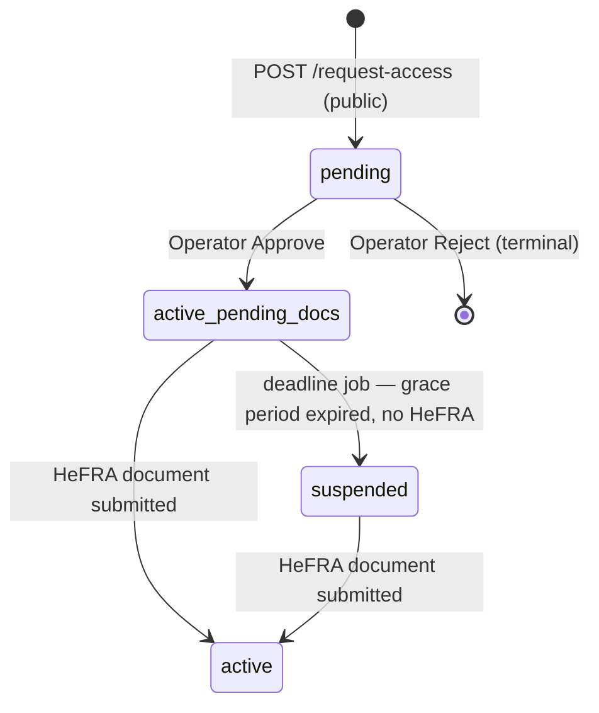

# Pulse Health — Backend Implementation Spec

This document is derived directly from the Next.js frontend's mock-backed data
layer (`lib/api/*`, `lib/types/*`, `lib/mock/*`, `hooks/*`). It describes the
contract the Spring Boot backend must satisfy so the frontend can flip
`NEXT_PUBLIC_USE_MOCK` to `false` with zero component changes.

**Method**: every endpoint, type, and business rule below is cited to a
source file. Where the frontend does not define something (e.g. login,
appointment creation, queue check-in), that is called out explicitly as a
gap rather than invented — see §10.

**§2 and §3 are the one exception to that method.** The current frontend
has no concept of multi-tenancy or a platform-operator plane at all — see
the verification at the top of §2. Those two sections define the
architecture the backend must impose *on top of* everything derived from
code in §5 onward, not something extracted from it. Every domain in §5–§10
is written from a single-facility point of view (matching the code); read
it through the lens of §2 (every entity gets a `facilityId`, every query
gets tenant-filtered) rather than as a contradiction.

---

## 1. Overview

### Architecture

Three layers, per domain (`lib/api/appointments.ts:1-5` and identical
comments in every other `lib/api/*.ts` file):

```
components/hooks  →  hooks/use-*.ts (TanStack Query)  →  lib/api/*.ts (swap point)  →  lib/mock/*.ts | axios → Spring Boot
```

- `lib/api/*.ts` is the swap point. Every exported function checks
  `USE_MOCK = process.env.NEXT_PUBLIC_USE_MOCK !== "false"` (mock is the
  **default** unless the env var is the literal string `"false"`). When
  false, it calls the real REST API via the shared `axios` instance in
  `lib/axios.ts`.
- `lib/mock/*.ts` holds an in-memory array per domain, mutated for the
  session only (resets on reload/server restart). Mock business logic is
  the closest thing this codebase has to a backend spec for CRUD
  semantics — where it's silent, that's a real gap (§10).
- `hooks/use-*.ts` wraps everything in TanStack Query — query keys,
  polling (`refetchInterval`), cache invalidation on mutation.
- Every "list" endpoint returns the **full collection**, always. There is
  **no pagination, server-side filtering, or search parameter on any GET
  endpoint in the entire codebase.** All filtering/search/sort happens
  client-side over the full result set (see §9).

### Auth model (as it exists today — see gaps in §8)

- `lib/axios.ts:14-18` — every request attaches `Authorization: Bearer
  <token>`, where `token = localStorage.getItem("pulse_token")`.
- `lib/axios.ts:21-29` — a response interceptor is wired to bounce to
  `/login` on `401`, but the actual redirect/store-clear logic is
  commented out (placeholder only).
- **There is no `lib/api/auth.ts`.** No login, logout, refresh, or
  register endpoint is defined anywhere in the API layer, even though
  `/login` itself is now fully built (§4, §8.1) — `login()`/
  `verifyLoginOtp()` live directly in `lib/mock/auth.ts` with no
  real-API-call wrapper. `pulse_token` lands in `localStorage` via that
  mock; nothing in the frontend shows what a real token-issuance response
  looks like.
- Session identity resolves dynamically now, not a static fixture: `hooks/
  use-workspace-session.ts` reads whichever mock account's token is
  stored (`lib/mock/auth.ts`), falling back to the seeded doctor identity
  only in the (should-be-impossible) case it's read before a guard has
  resolved. Real implementation: read from JWT / httpOnly cookie /
  server-side session — same integration point, now actually exercised
  end to end by a real (mock) login flow instead of a hardcoded return.
- Still no `middleware.ts`, but **`/d` and `/w` are no longer reachable by
  anyone** — `RequireRole` (`components/auth/require-role.tsx`, wired into
  both layouts) redirects an unauthenticated visitor to `/login` and a
  wrong-role one to their own home. This is a component-level guard, not
  route middleware, and it says so itself: *"this only prevents an
  unauthenticated or wrong-role user from seeing a flash of the wrong
  app's chrome before a real backend would reject their requests
  anyway."* Real access control is still entirely a backend
  responsibility (§8) — this is UX, not enforcement.

### Base URL / versioning

`lib/axios.ts:5` — `baseURL: process.env.NEXT_PUBLIC_API_URL ?? "http://localhost:8080/api"`.
No version prefix (`/v1`, etc.) appears anywhere. All paths below are
relative to this base.

---

## 2. Multi-tenancy & isolation architecture

**This section is not derived from the frontend — it's the opposite: a
verified absence.** A repo-wide search confirms `facilityId` /
`facility_id` / `tenant` appear **nowhere** in `lib/types/*`,
`lib/api/*`, or `lib/mock/*`. Every mock domain (`lib/mock/patients.ts`,
`staff.ts`, `departments.ts`, `appointments.ts`, `queue.ts`,
`notifications.ts`, `settings.ts`) holds a single flat in-memory array
with no tenant partitioning, and `GET /facility/current` (§6.8) is
**singular** — no facility id/param anywhere signals the frontend was
built assuming exactly one hardcoded facility ("KNUST University
Hospital," seeded identically in `lib/mock/dashboard.ts` and
`lib/mock/settings.ts`). Nothing about tenant boundaries can be extracted
from this codebase because the concept doesn't exist in it yet.

Everything in this section is therefore an **architectural requirement
the backend must add**, not a contract to port from the mock. §5–§10
describe every domain from that single-facility point of view (matching
the code) — read every entity/endpoint there as implicitly scoped to one
`facilityId`, enforced per the rules below.

### 2.1 Tenant boundary: every facility-plane entity carries `facilityId`

Every clinical/operational entity in §5 gets a `facilityId` column at the
persistence layer:

| Domain (§ reference) | Entities that need `facilityId` |
|---|---|
| Facility itself (§3) | the tenant row — `id` **is** the `facilityId`; owned by the platform plane, not the facility plane |
| Departments (§5.3) | `Department` |
| Staff (§5.6) | `StaffMember` |
| Patients (§5.5) | `Patient` |
| Appointments (§5.2) | `Appointment` |
| Live Queue (§5.4) | `QueueEntry` (and, transitively, anything derived from it — `QueueDepartment` aggregates) |
| Notifications (§5.7) | `Notification` |
| Settings (§5.8) | `FacilityProfile`, `AdminProfile`, `OperationalSettings`, `ActiveSession`, `TwoFactorState`, `RoleInvite`, `PermissionMatrixRow`, `AccountRequest` — every settings sub-resource is per-facility, not global |
| Analytics/Dashboard (§5.9–§5.10) | computed *from* tenant-scoped data — the aggregation itself must be scoped, not just its inputs |

**Critical nuance**: `facilityId` must **never** be a client-settable
field on any create/update request DTO (`CreatePatientInput`,
`CreateStaffInput`, `CreateDepartmentInput`, etc., §5). It is injected
server-side from the caller's JWT claim (§2.3) on every write, and used
as a mandatory filter predicate on every read. If it appeared as a
request field, a malicious or buggy client could write into — or read
from — a different tenant simply by changing it. This is the single most
important rule in this document.

### 2.2 Isolation is absolute and backend-enforced

- Every query, on every endpoint in §6, must be filtered by the
  `facilityId` taken from the caller's JWT — never from a query param,
  path param, or body field the client controls.
- Recommended enforcement mechanism: database-level row-level security
  (e.g. Postgres RLS keyed on a session variable set from the JWT at the
  start of each request) or, at minimum, a mandatory `WHERE facility_id =
  :jwtFacilityId` applied at a single shared repository/query layer that
  individual endpoint code cannot opt out of (a Hibernate filter enabled
  per-session, or a base repository class every domain repository must
  extend — not a convention every developer has to remember per-query).
  The goal is that **omitting the filter should be a compile-time or
  startup-time impossibility, not a code-review discipline.**
- **A leak across tenants is a breach, not a bug.** Treat any code path
  that can return or mutate another facility's row — even one field, even
  in an aggregate count — as a security incident requiring the same
  response as a credential leak, not a defect ticket. This should be
  stated in the team's incident-severity policy, not just implied by
  code review.
- Restate explicitly: **none of this exists in the current frontend/mock
  to reference.** There is no facility-scoped filtering anywhere to
  "keep consistent with" — the backend is introducing this from zero,
  and every domain's mock business rules in §7 should be read as
  "correct, but implicitly for one tenant" — the backend adds the
  `facilityId` predicate around all of it.

### 2.3 JWT claim shape — facility plane

```jsonc
{
  "sub": "<staff id>",                 // maps to StaffMember.id (§5.6)
  "facilityId": "<tenant id>",         // mandatory; exactly one
  "role": "admin" | "doctor" | "nurse" | "front-desk" | "read-only",
  // + standard claims: iat, exp, iss, aud
}
```

- **Facility-plane tokens are bound to exactly one `facilityId`.** A
  token is never valid across more than one tenant. If a real person
  legitimately works at two facilities (a locum doctor, a multi-site
  admin), that is two separate `StaffMember` rows (one per facility) and
  either two separate logins or an explicit facility-switch flow that
  re-issues a new token scoped to the newly-selected facility — it is
  never one token carrying two `facilityId`s or a facility-list claim.
  This is a recommendation to confirm with the team (§10.10), but "one
  token, one facility" is the constraint this architecture is built on.
- `role` here is `StaffRole` from `lib/types/staff.ts` (§5.6) restricted
  to the four facility-plane values named by product plus `read-only`,
  which already exists in `StaffRole` today even though no route
  currently branches on it (`WorkspaceSession.role`, §5.1, is narrower —
  just `admin | doctor` — and needs to grow to carry the full `StaffRole`
  set plus this new `facilityId` claim to become the real session shape).
- Compare to today's `WorkspaceSession` (§5.1): it has `departmentId`/
  `departmentName` but **no `facilityId`** — that field must be added,
  always sourced from the token, never editable by the client (same rule
  as §2.1).

### 2.4 Two planes, mutually firewalled

| | Facility plane | Platform plane |
|---|---|---|
| Roles | `admin`, `doctor`, `nurse`, `front-desk`, `read-only` (`StaffRole`, §5.6) | `platform-operator` (new — Pulse's own staff) |
| Scope | exactly one `facilityId` (§2.3) | **no** `facilityId` — belongs to no tenant |
| Token claim | `facilityId` present and non-null | `facilityId` **absent** |
| Endpoints | §6 (everything derived from the frontend) | §3 (new — metadata/lifecycle only) |
| Existing precedent | `/d` (admin) vs. `/w` (doctor) — same auth realm, same token *type*, different UI | **not** precedented by `/d` vs `/w` — a different, stricter split (see §3.1) |

**How the two are told apart and firewalled**, as a concrete
recommendation (new design, not extracted):
- Use a distinct `aud` (audience) claim per plane — e.g.
  `aud: "pulse-facility"` vs. `aud: "pulse-platform"` — and, for
  defense in depth, sign the two token types with different keys /
  issue them from different auth flows entirely, so a bug in one
  verifier can't accidentally accept the other plane's token.
- Enforce the check in shared middleware/filter-chain code that runs
  **before** any endpoint handler — every facility-plane route rejects
  any token without a `facilityId` claim (or wrong `aud`) at the gate;
  every platform-plane route rejects any token **with** a `facilityId`
  claim. This must not be a per-endpoint check developers remember to
  add — it should be structurally impossible to reach facility business
  logic with a platform token or vice versa.

---

## 3. Platform-operator plane

A new, bounded surface for Pulse's own staff to administer facilities as
tenants. **Nothing below exists in the current frontend** — there is no
operator console, no facility-list UI, no suspend/reactivate action
anywhere in the codebase. This section defines the boundary such a
surface must respect if/when it's built, informed by the shape of
`FacilityProfile`/`FacilitySummary` (§5.8–§5.9) as the closest existing
reference for "what a facility's own metadata looks like."

### 3.1 Structural separation — its own surface, not tabs on `/d`

The operator console is a **separate application and a separate API
namespace** from the facility plane, analogous to but stricter than the
existing `/d` vs. `/w` split:

- `/d` and `/w` are two UIs sharing **one auth realm** — a facility-plane
  JWT works for both, differing only in role/department scoping. That
  precedent does **not** apply here.
- The platform-operator surface must be reachable only through its own
  auth flow, issuing only platform-plane tokens (§2.4), and should live
  under its own routing namespace (e.g. a distinct API base path such as
  `/platform/*`, and ideally a distinct deployed frontend rather than a
  new tab inside the admin dashboard) — recommended, not dictated by any
  existing code, since no such surface exists to extract a pattern from.
- Concretely: **do not** add a "Facilities" tab to `app/(dashboard)/d/`.
  Doing so would put platform-operator UI inside the same app that
  renders facility-scoped patient/appointment data, one wrong permission
  check away from cross-tenant exposure. Keep the blast radius of a
  platform-console bug limited to metadata, by construction.

### 3.2 Endpoints — metadata and lifecycle only

| Method | Path | Purpose | Response shape (informed by §5.9 `FacilitySummary`) |
|---|---|---|---|
| GET | `/platform/facilities` | List all tenants | `{ id, name, type, region, status, plan, createdAt }[]` — counts/status only, no per-facility operational data |
| GET | `/platform/facilities/{id}` | One tenant's metadata | Same shape as above, single object |
| GET | `/platform/facilities/{id}/usage` | Aggregate usage for one tenant | e.g. `{ departmentCount, staffCount, patientCount, appointmentsThisMonth }` — **counts and status only**, see hard constraint in §3.3 |
| PATCH | `/platform/facilities/{id}/approve` | Approve a `pending` tenant | See §4 — flips to `active_pending_docs`, unlocks onboarding |
| PATCH | `/platform/facilities/{id}/reject` | Reject a `pending` tenant | See §4 — terminal, no facility ever provisioned |
| PATCH | `/platform/facilities/{id}/suspend` | Suspend a tenant | Sets `status`; see §10.10 for JWT-revocation implications |
| PATCH | `/platform/facilities/{id}/reactivate` | Reactivate a suspended tenant | Sets `status` |

`status` here is the same `FacilityAccountStatus` lifecycle documented in
§4 (`pending | active_pending_docs | active | suspended`) — this table
previously spoke of a generic `active | suspended` before that lifecycle
existed anywhere in code; §4 is now the authoritative source. `plan` is
still entirely undefined by anything in this codebase (§10.10 — billing
model is an open question, not something to infer).

Note there is **no `POST /platform/facilities`** (operator-initiated
tenant creation) in this table anymore — §4 confirms the frontend
implements **self-serve** signup (`/request-access`, public,
unauthenticated) as the only tenant-creation path that exists in code.
An operator-initiated creation endpoint (for sales-led onboarding) may
still be worth adding, but that would be net-new design, not something
to extract from here — see §10.10.

### 3.3 Hard constraint: metadata only — no patient/clinical data, no impersonation

This is a firewall the **backend enforces**, not a UI-level choice to
simply not build a button for:

- **No platform-operator endpoint may return patient records, appointment
  details, clinical data (allergies, medications, vitals — §5.5), or any
  individual row belonging to a facility's tenant data.** Every response
  in §3.2 is a count, a status, or facility-level metadata — never a
  join into `Patient`, `Appointment`, `QueueEntry`, or any clinical
  table.
- **No impersonation / "view as facility."** A platform-operator token
  must never be exchangeable for, or accepted in place of, a facility-
  plane token. If an operator genuinely needs to debug a facility's data
  (a real operational need), that must go through an explicit,
  audited, time-boxed support-access grant issued *by* the facility
  (out of scope for this spec — flagged, not designed here) — never a
  standing platform-operator privilege.
- **Small-number aggregates can still leak individuals.** If
  `/platform/facilities/{id}/usage` would report, e.g., `patientCount:
  1`, that number effectively identifies a specific person's existence
  at that facility to platform staff who have no clinical relationship
  to them. Recommend suppressing or bucketing counts below a threshold
  (e.g. report `"< 5"` rather than an exact small integer) rather than
  exposing raw low counts — a k-anonymity-style precaution. This is a
  design recommendation, not something derivable from any existing code.
- Enforcement point: the `platform-operator` role should have **zero**
  data-layer grants on any facility-plane table — not "hidden by the
  API," but structurally unable to query them (separate database role/
  schema permissions, or a service boundary where the platform service
  physically cannot reach facility-plane data stores). API-layer
  filtering alone is not sufficient given the stated severity (§2.2 —
  a cross-tenant or cross-plane leak is a breach).

### 3.4 Facility onboarding/provisioning is a platform-plane concern

**This section originally described the onboarding UI as a non-functional
stub with no backend contract to extract. That's no longer true — the
frontend now implements the full provisioning flow end to end (mock-only,
but real routing/state/validation), and §4 is the authoritative
extraction of it.** What follows here is only the platform-plane framing;
see §4 for the actual states, entities, and endpoints.

Provisioning a new tenant spans **both** planes, and that split is the
important thing to take from this section:

- **The public, self-serve half is facility-plane-adjacent but
  unauthenticated**: `/request-access` (§4.3) collects light contact
  info and creates a `pending` tenant. No JWT of either kind exists yet
  at this point — there's no facility to scope a facility-plane token to,
  and the requester isn't a Pulse operator.
- **The approval half is squarely platform-plane**: only a
  platform-operator token can move a tenant out of `pending`
  (`PATCH /platform/facilities/{id}/approve` or `.../reject`, §3.2, §4.4)
  — this is exactly the kind of tenant-lifecycle action §3.1–§3.3
  describe the operator console for.
- **Onboarding itself (facility details, departments, admin account,
  email verification — §4.5) runs on neither plane cleanly**: the visitor
  filling it out isn't a platform operator, but they don't have a
  facility-plane session yet either (that's what completing onboarding
  produces). Treat it as a **pre-session, approval-token-gated** flow, not
  as belonging to either plane's normal auth model — see §4.3's note on
  the mock's approval-token stand-in for how the frontend handles this
  today, and §10.10 for the real-token design question it leaves open.

Creating a facility's own first administrative account (the end of §4.5)
is the one case where a provisioning action legitimately produces
facility-plane data — it's tenant self-provisioning, not a platform
operator reading another tenant's clinical data, so it does not violate
the "metadata only" constraint in §3.3.

---

## 4. Tenant provisioning & compliance lifecycle

**Unlike §2–§3, this section largely *is* extracted from real code** —
`/request-access` and `/onboarding` (§4.3, §4.5) are fully built (mock
data, real routing/validation/state), and the facility grace-period
display (§4.6) is wired into `/d` today. The gaps are narrower and more
specific than "doesn't exist yet": a missing operator-approval step, a
missing backend deadline job, and one concrete UI dead-end this section
calls out precisely. Where something is mock-simulated rather than real
(auto-approval, a hardcoded demo identity), that's flagged inline.

This is the two-ends-of-one-lifecycle handshake named in the brief:
**`/request-access` (tenant request) ↔ operator Approve (§3) ↔ compliance
suspension (§4.6) are one provisioning-and-compliance flow**, not three
unrelated features. §4.2's state diagram is the throughline connecting
them.

### 4.1 Three actors, one lifecycle

| Actor | Plane | Does |
|---|---|---|
| Prospective facility | none (public, unauthenticated) | Submits `/request-access` → creates a `pending` tenant (§4.3) |
| Platform operator | platform (§2.4, §3) | Approves or rejects the pending tenant (§4.4) |
| Facility admin (the requester, once approved) | pre-session, approval-token-gated (§3.4) → facility (once onboarding completes) | Completes onboarding (§4.5); later, submits the HeFRA document via Settings to clear the grace period (§4.6) |
| Backend deadline job | backend-internal, no UI actor | Suspends a tenant whose grace period expired without a HeFRA document (§4.6) |

### 4.2 Tenant states

`FacilityAccountStatus` as coded today (`lib/types/settings.ts`) has only
three values — `"active" | "active_pending_docs" | "suspended"`. **The
real lifecycle needs a fourth, `"pending"`, that doesn't exist in the type
or the mock**: the frontend's `/request-access` auto-"approves" every
submission immediately (`lib/mock/access-request.ts:22-26`, see §4.3), so
nothing in the mock ever actually sits in a pending-review state. The
table and diagram below describe the **required** four-state lifecycle;
the code-vs-spec gap is called out again in §4.3 and §10.10.

| State | Meaning | Facility usable? | Entered from | Left via |
|---|---|---|---|---|
| `pending` | Tenant requested, awaiting operator review | No — no facility, no accounts exist yet | `/request-access` submission | Operator Approve → `active_pending_docs`; Operator Reject → terminal (no facility ever created) |
| `active_pending_docs` | Onboarding complete (or in progress — see §4.5), fully working, HeFRA still owed | **Yes, fully** | Operator Approve | HeFRA submitted → `active`; deadline passed with no HeFRA → `suspended` (backend job) |
| `active` | HeFRA verified, no restrictions | Yes | HeFRA submitted from `active_pending_docs` **or** `suspended` | HeFRA status is not tracked further once `active` — no defined path back to a grace state (open question, §10.10: does a real backend ever need to re-flag an already-verified facility, e.g. license expiry?) |
| `suspended` | Grace period expired without HeFRA | **No** — `components/dashboard/facility-suspended-block.tsx` fully replaces the app shell | Deadline job, from `active_pending_docs` | HeFRA submitted → `active` (see the real gap noted in §4.6 — this transition has no working UI path today) |



### 4.3 `pending` — created by `/request-access`

`app/(auth)/request-access/page.tsx` collects a **light contact form**,
distinct from (and narrower than) the full `FacilityProfile` (§5.8):

```ts
// lib/mock/access-request.ts
export interface AccessRequestInput {
  facilityName: string;
  contactName: string;
  email: string;
  phone: string;
  region: string;
}
```

On submit, `submitAccessRequest(input)` (`lib/mock/access-request.ts:22-26`)
is the mock stand-in for tenant creation — real backend equivalent:
`POST /public/access-requests` (unauthenticated, rate-limited/anti-abuse
per §10.10), creating a `pending` tenant row from exactly these five
fields and nothing more.

**The mock auto-approves.** The function's own header comment says so
outright: *"submission auto-'approves' (stores a mock token) so the
onboarding flow stays previewable without a real email system."* It
returns `{ token }` immediately, no review step, no operator involved —
the frontend has no code path that represents a tenant actually *sitting*
in `pending`. `storeApprovalToken`/`getApprovalToken`/`clearApprovalToken`
(`lib/mock/access-request.ts:28-43`) persist that token to
`localStorage["pulse_onboarding_token"]`, which `hooks/use-access-request.ts`
reads to gate `/onboarding` (§3.4) — the same frontend-guard pattern
`RequireRole` uses for `/d` and `/w` (§8.2), applied to a pre-session flow
that has neither a facility-plane nor platform-plane token to check.
**A real backend must not auto-approve** — this mock shortcut exists
purely so the rest of the flow (§4.5 onward) could be built and previewed
without a working operator console or email system; it is not a business
rule to replicate.

The confirmation screen (same page, post-submit) states the three things
honestly, matching the required copy verbatim: review happens by email,
a valid HeFRA license/document is still required after approval, and
missing it past the grace period suspends the workspace until provided —
this is the user-facing preview of §4.6's compliance rule, shown before
the facility even exists.

### 4.4 `pending` → `active_pending_docs` (or rejected) — operator action

This is the platform-plane half (§3.2's `approve`/`reject` endpoints).
**Nothing in the frontend implements this step** — the mock's
auto-approval (§4.3) exists specifically because no operator console
exists to perform a real review. Required behavior, inferred from the
lifecycle rather than extracted from any operator UI:

- **Approve** (`PATCH /platform/facilities/{id}/approve`): flips
  `pending → active_pending_docs`, sets the HeFRA grace-period deadline
  (`hefraDueDate`, §4.6 — the mock defaults this to *"now + 12 days"* at
  facility-creation time, `lib/mock/settings.ts`; a real backend would set
  it at *approval* time instead, since that's when the clock in the
  confirmation copy — "we'll review your request… then the grace period
  starts" — actually begins), and **triggers the admin invite**: an email
  to the request's `contactName`/`email` with a link that carries a real
  (server-verifiable) approval token — the backend equivalent of what
  `storeApprovalToken` fakes with `localStorage` today.
- **Reject**: terminal. No facility row is ever fully provisioned (or it's
  marked rejected and excluded from every other facility-plane query —
  implementation detail, not specified by anything in the frontend). No
  UI for this exists to extract a rejection-reason field or notification
  copy from; that's net-new design.

**A real invite token is a harder problem than the mock's approximation.**
The mock's token is just a client-stored flag with no expiry, no
single-use enforcement, and no server verification — acceptable for a
demo, not for a real approval link. This connects to the same open
question already on file about `/(auth)/activate`'s invite-token handling
(§10.4) — both are instances of "a link with a token gates access to
finish setting up an account," and a real implementation should probably
share one mechanism rather than invent two.

### 4.5 Onboarding — completes the tenant, HeFRA optional here

`app/(auth)/onboarding/page.tsx` is gated on the approval token (§4.3)
and walks four steps via `?step=`, each a separate component under
`components/onboarding/steps/`:

| Step | Collects | Required to advance |
|---|---|---|
| `facility-setup` | `hospitalName, region, address, hefraLicense, document, logoUrl` | **Only the logo** (`FacilitySetupStep`'s `handleSubmit`, `components/onboarding/steps/facility-setup-step.tsx`: `if (!formData.logoUrl) { setLogoError(true); return; }`). `hefraLicense`/`document` are explicitly optional — labeled "(optional)" and "speeds up verification" in the UI, matching the required compliance framing: HeFRA is never a signup blocker, only a post-signup deadline (§4.6). |
| `departments` | `phone, email, specialties, capacity, duration, operatingHours` (the facility's public-facing operational fields) | Nothing — no required-field validation on this step at all |
| `admin` | `fullName, phone, email, password, confirmPassword, agreed` (first admin's own identity) — **local component state, not the shared onboarding store** | Passwords must match; terms checkbox must be checked |
| `verify-email` | 6-digit OTP | Any 6-digit code (mock convention, same as `/activate`, §10.4) |

All fields except the admin step's are held in a **sessionStorage-persisted**
Zustand store (`store/use-onboarding-store.ts`) so the flow survives a
refresh — deliberately **excluding** the password (never persisted, even
to sessionStorage) and the HeFRA `document` (a raw `File`, not
JSON-serializable; harmless to drop now that it's optional).

**Two gaps worth flagging for the real implementation:**

1. **The admin step's identity fields are never pre-filled from the
   original access request.** `AccessRequestInput.contactName`/`email`/
   `phone` (§4.3) and the admin step's `fullName`/`email`/`phone`
   (`components/onboarding/steps/admin-step.tsx:25-32`) are two entirely
   separate, disconnected form states — the person who requested access
   has to re-type their own name, email, and phone from scratch at the
   admin step. A real implementation should almost certainly pre-fill
   these from the approved request.
2. **Completing verification does not create a new admin account.**
   `VerifyEmailStep`'s success handler (`components/onboarding/steps/
   verify-email-step.tsx:32`) calls
   `finalizeLogin(tokenForSession(MOCK_ADMIN_SESSION))` — it logs the
   visitor in as this demo's one hardcoded seeded admin (`"Dr. Sarah
   Jenkins"`), **regardless of the name/email/password actually typed
   into the admin step**. This is a mock-only stand-in (there's no real
   backend to register a new account against) — a real backend must
   actually create a new `StaffMember` with `role: "admin"`, scoped to
   the newly-created `facilityId`, from the admin step's submitted data,
   and issue a facility-plane JWT (§2.3) for *that* account, not a
   fixture.

Tenant status remains `active_pending_docs` through and after onboarding
in every case — **submitting a HeFRA document during `facility-setup`
does not flip status to `active` anywhere in the code.** Whether a real
backend should auto-resolve the grace period when HeFRA arrives this
early (before the facility even exists) or still require the same
post-signup review as a §4.6 submission is not decided by anything here —
open question, §10.10.

### 4.6 Compliance grace period & suspension

The grace-period state is fully wired into `/d` today — this is the part
of the lifecycle with the most real, working (mock) code to extract from.

**Data**: `FacilityProfile` (`lib/types/settings.ts`) carries
`status: FacilityAccountStatus`, `hefraDueDate?: string` (ISO date), and
`hefraDocumentUrl?: string` (object URL from the settings-page uploader —
same mock-only, not-persisted-past-refresh caveat as `logoUrl`, §9.3).
The seed (`lib/mock/settings.ts`) defaults to `status: "active_pending_docs"`
with `hefraDueDate: now + 12 days`, specifically so the grace-period UI is
visible without any setup — see the file's own comment for how to preview
`suspended` too (a `?facilityStatus=` override, dev-only, never touches
the underlying mock value; see below).

**Display** (`components/dashboard/facility-status-gate.tsx`, wired into
`app/(dashboard)/d/layout.tsx` inside `RequireRole`, §7/§8):
- `active_pending_docs` → `FacilityStatusBanner` renders as a persistent,
  full-width strip above every `/d` page: *"HeFRA document required —
  submit by \<date\> or your workspace will be suspended,"* linking to
  `/d/settings?tab=facility`.
- `suspended` → `FacilitySuspendedBlock` **fully replaces the entire app
  shell** (sidebar included) — nothing in `/d` is reachable, only "Contact
  support" (`mailto:`) and "Sign out" remain. Both components carry an
  explicit disclaimer in their rendered copy — *"Frontend display only —
  suspension is enforced by the backend"* — matching the hard requirement
  that the frontend never decides this itself (§2.2's "a leak is a
  breach" framing applies to authority-boundary violations too, not just
  data: a frontend that could suspend or unsuspend a tenant on its own
  would be exactly that kind of violation).

**Resolution — HeFRA submission from `active_pending_docs`, and a real
gap for `suspended`:** the Settings → Facility page
(`components/dashboard/settings/facility-section.tsx`) renders a document
upload control whenever `facility.status !== "active"`, and its submit
handler contains the one piece of real state-transition logic in this
whole lifecycle:

```ts
// components/dashboard/settings/facility-section.tsx
const resolved =
  values.hefraDocumentUrl && facility?.status === "active_pending_docs";
update.mutate(
  { ...values, status: resolved ? "active" : values.status },
  { onSuccess: (saved) => { reset(saved); markSaved(); } },
);
```

This correctly resolves `active_pending_docs → active` on submission. It
**does not** handle `suspended → active` — the condition only ever
matches `"active_pending_docs"`, so a suspended facility that somehow
submitted a document through this form would have its status silently
re-sent unchanged. **In practice this path can't even be reached today**:
`FacilityStatusGate` replaces the *entire* `/d` shell — including Settings
— with `FacilitySuspendedBlock` the moment `status === "suspended"`, so
there is currently **no UI route to the upload control at all** once
suspended, despite `FacilitySuspendedBlock`'s own copy promising *"Submit
your document to restore access."* This is a real, verified inconsistency
in the current build, not a hypothetical — flagged here rather than
silently fixed because the right fix depends on a product decision this
document can't make: does resolving a suspension stay inside the normal
`/d` app (meaning `FacilityStatusGate` needs a narrower carve-out that
lets *just* the Facility settings page through while suspended), or
should it require a separate, deliberately-outside-the-app recovery flow
(e.g., a dedicated link from the "Contact support" email, so a suspended
tenant can't just quietly self-serve back to `active` without any human
review)? Either is defensible; nothing in the code picks one.

**The backend deadline job**: nothing in the frontend can enforce this —
by design (§2.2, §4.6's display section above) — but the lifecycle
requires a scheduled backend process that, for every `active_pending_docs`
tenant whose `hefraDueDate` has passed with no `hefraDocumentUrl`
(or backend-side equivalent) on file, transitions it to `suspended`.
Cadence, retry/notification behavior (does the facility get a warning
email before the deadline, per the "we'll notify you" framing in
§4.3's confirmation copy?), and whether suspension is instant-at-deadline
or has its own short buffer are all undecided — §10.10.

---

## 5. Data models

Types are reproduced verbatim from `lib/types/*.ts`. Fields never accepted
as client input (only ever server/mock-computed) are marked **[server-only]**.

### 5.1 Auth / Session — `lib/types/auth.ts`

```ts
export type SessionRole = "admin" | "doctor";

export interface WorkspaceSession {
  staffId: string;
  role: SessionRole;
  name: string;
  email: string;
  departmentId: string;
  departmentName: string;
  title: string;
  specialty?: string;
  avatarUrl?: string;
}
```

Note: `SessionRole` (2 values: `admin | doctor`) is narrower than
`StaffRole` (5 values, §5.6) — the app currently only branches `/d` vs
`/w` routing on this 2-way split, even though the permission matrix (§5.8)
models 5 distinct roles.

### 5.2 Appointments — `lib/types/appointments.ts`

```ts
export type AppointmentStatus =
  | "scheduled"   // booked, patient hasn't confirmed
  | "confirmed"   // patient confirmed they're coming
  | "checked_in"  // patient has arrived (hand-off point to Live Queue)
  | "completed"   // visit finished
  | "cancelled"   // called off ahead of time
  | "no_show";    // confirmed but never arrived

export type AppointmentType = "in_person" | "virtual";
export type AppointmentPriority = "emergency" | "urgent" | "routine";

export interface Appointment {
  id: string;
  reference: string;        // human-facing code, e.g. "APT-1041"
  patientId: string;
  patientName: string;
  departmentId: string;
  departmentName: string;
  doctorName: string;
  scheduledAt: string;      // ISO datetime
  durationMinutes: number;
  status: AppointmentStatus;
  type: AppointmentType;
  priority: AppointmentPriority;
  reason?: string;
}

export interface AppointmentDepartment { id: string; name: string; }

export interface AppointmentStats {
  total: number; scheduled: number; confirmed: number;
  checkedIn: number; completed: number; cancelled: number; noShow: number;
}

export interface AppointmentFilters {
  date: string;                          // YYYY-MM-DD
  departmentId?: string | "all";
  status?: AppointmentStatus | "all";
}

export interface UpdateAppointmentInput { id: string; status: AppointmentStatus; }
```

**There is no `CreateAppointmentInput` type and no create-appointment
endpoint anywhere in the codebase** — see §10.1.

### 5.3 Departments — `lib/types/departments.ts`

```ts
export type DepartmentStatus = "active" | "closed" | "archived";

export interface Department {
  id: string; name: string; code: string; description?: string;
  status: DepartmentStatus; headDoctorName: string;
  doctorsOnDuty: number; totalDoctors: number; rooms: number;   // staffing/capacity
  waiting: number; inConsultation: number;                       // [server-only, see §10.2]
  avgWaitMinutes: number; appointmentsToday: number;             // [server-only, see §10.2]
  opensAt: string; closesAt: string; twentyFourSeven?: boolean;
}

export interface DepartmentStats {
  total: number; active: number; closed: number;
  doctorsOnDuty: number; rooms: number; waiting: number;
}

export interface CreateDepartmentInput {
  name: string; code: string; description?: string; headDoctorName: string;
  totalDoctors: number; rooms: number; opensAt: string; closesAt: string;
  twentyFourSeven?: boolean;
}

export interface UpdateDepartmentInput extends Partial<Omit<CreateDepartmentInput, never>> {
  id: string; status?: DepartmentStatus;
}

export interface AssignHeadDoctorInput { id: string; headDoctorName: string; }
```

`waiting`, `inConsultation`, `avgWaitMinutes`, `appointmentsToday`,
`doctorsOnDuty` are **not** present in `UpdateDepartmentInput` — there is
no client-triggerable way to set them directly (only `createDepartment`
initializes them, and closing/archiving zeroes three of them — see §7.2).

A **second, separate, lighter-weight department list** exists:
`AppointmentDepartment { id, name }` (§5.2), served from
`GET /appointments/departments`, containing only 4 of the 6 real
departments (missing `maternity`, `laboratory`). A **third** copy exists
in the Queue domain (§5.4) with a `room` field. All three are
unsynchronized in the mock — see §10.2.

### 5.4 Live Queue — `lib/types/queue.ts`

```ts
export type QueueStatus = "waiting" | "in_consultation" | "completed" | "no_show" | "skipped";
export type QueuePriority = "routine" | "urgent" | "emergency";
export type PatientSource = "walk_in" | "appointment";

export interface QueueEntry {
  id: string;
  ticketNumber: string;      // "A-014"
  patientName: string;
  departmentId: string;
  status: QueueStatus;
  priority: QueuePriority;
  source: PatientSource;
  checkInAt: string;         // ISO — when they joined the queue
  calledAt?: string | null;  // [server-only] ISO — when moved into consultation
  clinician?: string | null; // [server-only] derived from session on call-next
  room?: string | null;      // [server-only] assigned on call-next
}

export type DepartmentSeverity = "ok" | "warning" | "critical";

export interface QueueDepartment {
  id: string; name: string;
  waiting: number;                  // [server-only] count of waiting entries
  nowServing: string | null;        // [server-only] ticket in consultation
  longestWaitMinutes: number;       // [server-only] max(minutesSince(checkInAt)) over waiting
  severity: DepartmentSeverity;     // [server-only] derived, see §7.2
}

export interface CallNextInput { departmentId: string; entryId?: string; }
export interface UpdateStatusInput { entryId: string; status: QueueStatus; }
```

`QueueEntry.patientName` is a free-text string, **not** a foreign key to
`Patient.id` — the frontend has no `patientId` on queue entries at all
(confirmed gap, `app/(workspace)/w/patients/page.tsx:29`: *"keyed by
name — mock doesn't have patientId on entries"*).

### 5.5 Patients — `lib/types/patients.ts`

Header comment (normative, repeated inline at three call sites — see §7.5):
> *"Record-keeping only. This module... must never interpret [clinical
> data]. No abnormal-vital flagging, no drug-interaction/allergy warnings,
> no triage or dosage suggestions, no risk scoring. That keeps Pulse out
> of medical-device classification."*

```ts
export type Gender = "female" | "male" | "other";
export type VisitStatus = "checked_in" | "waiting" | "in_consultation";

export interface Medication { name: string; dose: string; frequency: string; }

export interface Vitals {
  bloodPressure: string; temperature: string; pulse: string; weight: string;
  recordedAt: string; // [server-only]
}

export interface CurrentVisit {
  status: VisitStatus; departmentId: string; departmentName: string;
  since: string; appointmentId?: string;
}

export interface Patient {
  id: string;
  patientNumber: string;    // [server-only] "PT-00123", see §7.5 for format
  name: string; dateOfBirth: string; gender: Gender; phone: string;
  email?: string; address?: string;
  registeredAt: string;     // [server-only]
  bloodType?: string;
  allergies: string[];              // always [], never null
  currentMedications: Medication[]; // always [], never null
  latestVitals?: Vitals;            // single snapshot, NOT a history — see §7.5
  currentVisit?: CurrentVisit;      // read-only from this domain, see §10.3
}

export interface CreatePatientInput {
  name: string; dateOfBirth: string; gender: Gender; phone: string;
  email?: string; address?: string; bloodType?: string;
}
export interface UpdatePatientInput extends Partial<CreatePatientInput> { id: string; }
export interface UpdateClinicalRecordInput {
  id: string; allergies?: string[]; currentMedications?: Medication[];
}
export interface RecordVitalsInput { id: string; vitals: Omit<Vitals, "recordedAt">; }
```

### 5.6 Staff — `lib/types/staff.ts`

Header comment: *"Doubles as the access role used by Settings → Team &
Access (staff ARE the users — there's no separate user/role list)."*

```ts
export type StaffRole = "doctor" | "nurse" | "admin" | "front-desk" | "read-only";
export type DutyStatus = "on_duty" | "off_duty" | "on_leave";
export type AccountStatus = "active" | "deactivated";

export interface StaffMember {
  id: string; name: string; role: StaffRole; title: string;
  specialty?: string;          // doctors only
  departmentId: string;        // "" when unassigned
  departmentName: string; email: string; phone?: string;
  shiftStart: string; shiftEnd: string; // "HH:MM"; overnight (end < start) is valid, see §7.6
  dutyStatus: DutyStatus;
  accountStatus?: AccountStatus; // undefined === "active"
  avatarUrl?: string;          // mock-only, not persisted — see §9.3
}

export interface CreateStaffInput {
  name: string; role: StaffRole; title: string; specialty?: string;
  departmentId: string; departmentName: string; email: string; phone?: string;
  shiftStart: string; shiftEnd: string;
  // NOTE: no dutyStatus or accountStatus — every new member starts
  // dutyStatus="on_duty", accountStatus=active (undefined). See §7.6.
}
export interface UpdateStaffInput extends Partial<Omit<StaffMember, "id">> { id: string; }
```

### 5.7 Notifications — `lib/types/notifications.ts`

```ts
export type NotificationType = "queue" | "no_show" | "appointment" | "staff" | "summary" | "system";

export interface Notification {
  id: string; type: NotificationType; title: string; body?: string;
  createdAt: string; read: boolean;
  link?: string; // route to navigate on click; absent = no action
}
```

No `severity`/`priority` field exists — visual urgency in the UI comes
only from `type` + `read`.

### 5.8 Settings — `lib/types/settings.ts`

Header comment (normative — see §8):
> *"CONSTRAINT: nothing in this module is enforced client-side... Pulse
> does not gate routes or actions on it — enforcement belongs to Spring
> Boot RBAC."*

```ts
export type FacilityType = "hospital" | "clinic" | "health_center" | "diagnostic_center";

// Grace-period account status. "active_pending_docs" means the facility is
// live but still owes a HeFRA verification document — the frontend only
// ever displays this (banner/block); actual suspension is backend-enforced.
// Missing a fourth "pending" value the real lifecycle needs — see §4.2.
export type FacilityAccountStatus = "active" | "active_pending_docs" | "suspended";

// Extends the same shape collected during onboarding (store/use-onboarding-store.ts) —
// Settings is the edit surface for that data, not a second source of truth.
export interface FacilityProfile {
  hospitalName: string; region: string; address: string; hefraLicense: string;
  logoUrl?: string;                 // mock-only
  phone: string; email: string; specialties: string[];
  capacity: string;                 // NOTE: string, not number — see §10.6
  duration: string;                 // NOTE: string, not number
  operatingHours: OperatingHoursValue;
  facilityType: FacilityType;
  status: FacilityAccountStatus;    // see §4.2–§4.6 for the full lifecycle
  hefraDueDate?: string;            // ISO date — grace-period deadline
  hefraDocumentUrl?: string;        // mock-only, same caveat as logoUrl
}
export type UpdateFacilityInput = Partial<FacilityProfile>;

export interface PersonalNotificationPreferences {
  emailOnNewAppointment: boolean; emailOnNoShow: boolean;
  smsOnQueueAlert: boolean; dailySummaryEmail: boolean;
}
export interface AdminProfile {
  fullName: string; title: string; email: string; phone: string;
  avatarUrl?: string;
  notificationPreferences: PersonalNotificationPreferences;
}
export type UpdateProfileInput = Partial<Omit<AdminProfile, "notificationPreferences">> & {
  notificationPreferences?: Partial<PersonalNotificationPreferences>;
};

export interface ChangePasswordInput { currentPassword: string; newPassword: string; }

export interface ActiveSession {
  id: string; device: string; browser: string; location: string;
  lastActive: string; current: boolean;
}

export interface TwoFactorState { enabled: boolean; } // no OTP/secret/QR anywhere — see §10.7

export interface UserPreferences { language: string; timezone: string; dateLocale: string; }

export type AccountRequestType = "deactivate" | "delete";
export interface AccountRequest {
  type: AccountRequestType; requestedAt: string; status: "pending" | "none";
}
export interface SubmitAccountRequestInput {
  type: AccountRequestType;
  transferOwnershipTo?: string; // defined but never read by the mock — see §10.6
}

export interface QueuePriorityLevel { id: string; label: string; weight: number; } // mirrors priorityRank, §7.2
export interface FacilityNotificationDefaults {
  sendPatientEmailConfirmations: boolean; sendPatientSmsReminders: boolean;
}
export interface OperationalSettings {
  queuePriorityLevels: QueuePriorityLevel[];
  queueRefreshSeconds: number; appointmentSlotMinutes: number; noShowGraceMinutes: number;
  notificationDefaults: FacilityNotificationDefaults;
}
export type UpdateOperationalInput = Partial<Omit<OperationalSettings, "notificationDefaults">> & {
  notificationDefaults?: Partial<FacilityNotificationDefaults>;
};

export interface RoleInvite {
  id: string; email: string; role: StaffRole; invitedAt: string; status: "pending";
}
export interface CreateInviteInput { email: string; role: StaffRole; }

export type PermissionLevel = "none" | "view" | "edit";
export interface PermissionMatrixRow {
  resource: string; permissions: Record<StaffRole, PermissionLevel>;
}
export interface UpdatePermissionInput { resource: string; role: StaffRole; level: PermissionLevel; }
```

Seed permission matrix (`lib/mock/settings.ts:285-293`) — 7 resources ×
5 roles, `none | view | edit`:

| Resource | admin | doctor | nurse | front-desk | read-only |
|---|---|---|---|---|---|
| Departments | edit | view | view | view | view |
| Live Queue | edit | edit | edit | edit | view |
| Appointments | edit | edit | edit | edit | view |
| Patients | edit | edit | edit | edit | view |
| Staff & Doctors | edit | view | view | view | view |
| Analytics | edit | view | none | none | view |
| Settings | edit | none | none | none | none |

### 5.9 Dashboard — `lib/types/dashboard.ts`

```ts
export type TrendDirection = "up" | "down";
export type Sentiment = "positive" | "negative" | "neutral";
export interface StatTrend { direction: TrendDirection; label: string; sentiment: Sentiment; }
export interface StatMetric { id: string; label: string; value: string; unit?: string; trend: StatTrend; }

export type QueueSeverity = "ok" | "warning" | "critical";
export interface DepartmentQueue {
  id: string; department: string; statusLabel: string;
  waiting: number; maxWaitMinutes: number; severity: QueueSeverity;
}

export type AlertSeverity = "critical" | "warning" | "info";
export interface DashboardAlert { id: string; severity: AlertSeverity; title: string; description: string; }

export interface VolumePoint { hour: string; walkIns: number; appointments: number; }
export interface FacilitySummary { id: string; name: string; }
export interface CurrentUser { id: string; name: string; role: string; }
```

`DepartmentQueue` duplicates `QueueDepartment` (§5.4) with different field
names and no shared backing data — see §10.2.
`CurrentUser` is a narrower, separately-shaped duplicate of
`WorkspaceSession` (§5.1) — see §10.8.

### 5.10 Analytics — `lib/types/analytics.ts`

Header comment (normative — see §7.5):
> *"All aggregation (daily rollups, totals, period-over-period,
> utilization) happens server-side. The UI only ever renders what it's
> given. Descriptive only: counts, averages, trends. No forecasting, no
> anomaly flagging, no recommended actions, no risk scoring."*

```ts
export interface DateRange { from: string; to: string; } // YYYY-MM-DD, inclusive

export interface DailyMetric {
  date: string; appointments: number; walkIns: number;
  patientVolume: number;    // appointments + walkIns
  avgWaitMinutes: number; p90WaitMinutes: number;
  served: number;           // queue throughput
  noShows: number; noShowRate: number; // 0-100
}

export interface AppointmentStatusBreakdown { status: string; label: string; count: number; }

export interface AnalyticsTotals {
  patientVolume: number; avgWaitMinutes: number; p90WaitMinutes: number;
  served: number; noShowRate: number;
}

export interface DepartmentAnalytics {
  departmentId: string; departmentName: string;
  daily: DailyMetric[]; totals: AnalyticsTotals; previousTotals: AnalyticsTotals;
  capacityPerDay: number; utilization: number; // 0-100, served vs capacity — see §7.7
}

export interface FacilityAnalytics {
  range: DateRange; daily: DailyMetric[];
  totals: AnalyticsTotals; previousTotals: AnalyticsTotals;
  appointmentsByStatus: AppointmentStatusBreakdown[];
  departments: DepartmentAnalytics[];
}

export interface AnalyticsQuery { from: string; to: string; }
```

### 5.11 Clinical records — `lib/types/records.ts`

Added for the doctor-authored records work in `/w` (Phase 1: read).
These are the **staff-scoped** shapes for the record history the patient
already reads on the mobile Records tab (`GET /api/patients/me/records`).

Header comment (normative — extends §7.5's "capture and show, never
advise" line to *authoring*):
> *"Pulse FAITHFULLY RECORDS clinician-authored content. It never
> contributes clinical judgement of its own... nothing built on these
> types may suggest a diagnosis, autocomplete or cross-check a
> medication, validate a dose against any norm, flag a lab value as out
> of range, or advise on a plan... 'Structured' here means the input is
> organized — it does not mean the app is smart."*

```ts
export type RecordAuthorRole = "doctor" | "lab";

export interface RecordAuthor {          // [server-only] stamped at write time
  staffId: string; name: string; role: RecordAuthorRole;
}

export interface VisitContext {
  visitId?: string;                      // see the note below
  departmentId: string; departmentName: string;
  startedAt?: string;                    // Patient.currentVisit.since
}

export interface VisitRecord {
  id: string; patientId: string;
  visit: VisitContext;
  author: RecordAuthor;                  // [server-only]
  recordedAt: string;                    // [server-only]
  presentingComplaint: string; examination: string;
  diagnosis: string;                     // FREE TEXT, never a picked code
  plan: string; summary: string;
}

export interface PrescriptionRecord {
  id: string; patientId: string; visitRecordId: string;
  author: RecordAuthor;                  // [server-only]
  prescribedAt: string;                  // [server-only]
  medication: string;                    // FREE TEXT, no autocomplete/catalog
  dose: string; frequency: string; duration: string;
  instructions?: string;
}

export interface LabResultValue {
  label: string; value: string;
  referenceRange?: string;               // the lab's own printed range, verbatim
}

export interface LabResultRecord {
  id: string; patientId: string; visitRecordId?: string;
  author: RecordAuthor;                  // role is always "lab"
  reportedAt: string;
  testName: string; specimen?: string;
  values: LabResultValue[]; notes?: string;
}

export interface PatientRecords {        // the mobile Records tab payload
  visits: VisitRecord[];
  prescriptions: PrescriptionRecord[];
  labResults: LabResultRecord[];
}
```

Authoring inputs (doctor-only, backend-pending — §6.12):

```ts
export interface CreateVisitRecordInput {   // author/recordedAt NOT sent
  patientId: string; visit: VisitContext;
  presentingComplaint: string; examination: string;
  diagnosis: string; plan: string; summary: string;
}

export interface PrescriptionDraft {        // plain strings, no catalog
  medication: string; dose: string; frequency: string; duration: string;
  instructions?: string;
}

export interface CreatePrescriptionsInput { // author/prescribedAt NOT sent
  patientId: string; visitRecordId: string;
  prescriptions: PrescriptionDraft[];
}
```

**Notes for the backend**:
- All three lists are **newest-first** and always arrays, never null
  (`lib/mock/records.ts` sorts on `recordedAt`/`prescribedAt`/
  `reportedAt` descending).
- `VisitContext.visitId` is optional because **the frontend has no stable
  visit id today** — `Patient.currentVisit` carries no id (§10.3). Until
  the backend owns a real `Visit` entity, a record identifies its visit
  by department + start time. Once `Visit` exists, `visitId` should
  become required and `departmentId`/`startedAt` become denormalized
  copies of it.
- `LabResultRecord` is **lab-authored, never doctor-authored**. `/w`
  renders it read-only; there is no staff-side write endpoint for it in
  this frontend (§6.11).
- `referenceRange` is stored and displayed **verbatim as part of the
  lab's report**. The app never compares `value` against it and never
  flags a value as abnormal — see §7.5.

---

## 6. Endpoints (exhaustive — every function in `lib/api/*`)

All paths relative to the base URL (§1). "Mock fallback" cites the
`lib/mock/*.ts` function called when `USE_MOCK` is true — useful as a
behavioral reference even though the real implementation is server-side.

### 6.1 Appointments — `lib/api/appointments.ts`

| Method | Path | Params | Body | Response | Mock fallback | Hook |
|---|---|---|---|---|---|---|
| GET | `/appointments` | query: `date`, `departmentId?`, `status?` (whole `AppointmentFilters` object) | — | `Appointment[]` | `queryAppointments(filters)` | `useAppointments(filters)` |
| GET | `/appointments/stats` | query: `date` | — | `AppointmentStats` | `computeStats(date)` | `useAppointmentStats(date)` |
| GET | `/appointments/departments` | — | — | `AppointmentDepartment[]` | `listDepartments()` | `useAppointmentDepartments()` |
| GET | `/appointments` | query: `from`, `to` | — | `Appointment[]` | `queryAppointmentsRange(from,to)` | `useAppointmentsRange(from,to)` |
| PATCH | `/appointments/{id}` | path `id` | `{ status: AppointmentStatus }` | `Appointment` | `applyUpdate(input)` | `useUpdateAppointment()` |

Note the **same path** `GET /appointments` serves two different query
shapes (`date`+filters for the day view, `from`/`to` for week/month range
views) — the backend must dispatch on which params are present, or the
frontend should be asked to split these into distinct paths.

**No create-appointment endpoint exists.** See §10.1.

### 6.2 Departments — `lib/api/departments.ts`

| Method | Path | Params | Body | Response | Mock fallback | Hook |
|---|---|---|---|---|---|---|
| GET | `/departments` | — | — | `Department[]` | `listDepartments()` | `useDepartments()`, `useDepartment(id)` (derived, no separate call) |
| GET | `/departments/stats` | — | — | `DepartmentStats` | `computeStats()` | `useDepartmentStats()` |
| PATCH | `/departments/{id}` | path `id` | `Omit<UpdateDepartmentInput,"id">` | `Department` | `applyUpdate(input)` | `useUpdateDepartment()` |
| POST | `/departments` | — | `CreateDepartmentInput` | `Department` | `createDepartment(input)` | `useCreateDepartment()` |
| PATCH | `/departments/{id}/head-doctor` | path `id` | `{ headDoctorName: string }` | `Department` | `assignHeadDoctor(input)` | `useAssignHeadDoctor()` |
| DELETE | `/departments/{id}` | path `id` | — | `void` | `deleteDepartment(id)` — **unconditional hard delete, no guard** | `useDeleteDepartment()` |

### 6.3 Live Queue — `lib/api/queue.ts`

| Method | Path | Params | Body | Response | Mock fallback | Hook |
|---|---|---|---|---|---|---|
| GET | `/queue/departments` | — | — | `QueueDepartment[]` | `buildDepartments(entries)` | `useQueueDepartments()` |
| GET | `/queue/entries` | query: `departmentId?` (omitted when `"all"`) | — | `QueueEntry[]` — **mock pre-filters to `waiting`/`in_consultation` only**, no status filter param exists | `getEntries(departmentId)` | `useQueueEntries(departmentId)` |
| POST | `/queue/call-next` | — | `CallNextInput` `{ departmentId, entryId? }` | `void` — **no confirmation of which entry was called; must change for real impl, see §7.1** | `promoteNext(input)` | `useCallNext()` |
| PATCH | `/queue/entries/{entryId}` | path `entryId` | `{ status: QueueStatus }` | `void` | `setStatus(id, status)` | `useUpdateQueueStatus()` |

**No check-in / create-entry endpoint exists.** See §10.1.

### 6.4 Patients — `lib/api/patients.ts`

| Method | Path | Params | Body | Response | Mock fallback | Hook |
|---|---|---|---|---|---|---|
| GET | `/patients` | — | — | `Patient[]` | `listPatients()` | `usePatients()`, `usePatient(id)` (derived) |
| GET | `/patients/{id}` | path `id` | — | `Patient` | `getPatient(id)` | **defined, never called** — see §10.3 |
| POST | `/patients` | — | `CreatePatientInput` | `Patient` | `createPatient(input)` | `useCreatePatient()` |
| PATCH | `/patients/{id}` | path `id` | `Omit<UpdatePatientInput,"id">` | `Patient` | `applyUpdate(input)` | `useUpdatePatient()` |
| PATCH | `/patients/{id}/clinical-record` | path `id` | `Omit<UpdateClinicalRecordInput,"id">` — `{allergies?, currentMedications?}` | `Patient` | `applyClinicalRecordUpdate(input)` | `useUpdateClinicalRecord()` |
| POST | `/patients/{id}/vitals` | path `id` | `Omit<Vitals,"recordedAt">` | `Patient` | `applyVitals(input)` | `useRecordVitals()` |

**No delete/archive endpoint exists for patients** — see §7.4.

### 6.5 Staff — `lib/api/staff.ts`

| Method | Path | Params | Body | Response | Mock fallback | Hook |
|---|---|---|---|---|---|---|
| GET | `/staff` | — | — | `StaffMember[]` | `listStaff()` | `useStaff()`, `useStaffMember(id)` (derived) |
| GET | `/staff/{id}` | path `id` | — | `StaffMember` | `getStaffMember(id)` | **defined, never called** |
| PATCH | `/staff/{id}` | path `id` | `Omit<UpdateStaffInput,"id">` | `StaffMember` | `applyUpdate(input)` | `useUpdateStaff()` — **also the only mechanism for account activate/deactivate, see §7.6** |
| POST | `/staff` | — | `CreateStaffInput` | `StaffMember` | `createStaff(input)` | `useCreateStaff()` |

**No delete endpoint exists for staff.**

### 6.6 Notifications — `lib/api/notifications.ts`

| Method | Path | Params | Body | Response | Mock fallback | Hook |
|---|---|---|---|---|---|---|
| GET | `/notifications` | — | — | `Notification[]` | `listNotifications()` | `useNotifications()` |
| GET | `/notifications/unread-count` | — | — | `{ count: number }` | `getUnreadCount()` | `useUnreadCount()` |
| PATCH | `/notifications/{id}/read` | path `id` | — | `Notification[]` (full list) | `markRead(id)` | `useMarkRead()` |
| POST | `/notifications/read-all` | — | — | `Notification[]` (full list) | `markAllRead()` | `useMarkAllRead()` |

**No create, delete, or mark-unread endpoint exists.** No trigger logic
exists anywhere in the mock — see §10.5.

### 6.7 Settings — `lib/api/settings.ts`

| # | Method | Path | Body | Response | Hook |
|---|---|---|---|---|---|
| 1 | GET | `/settings/facility` | — | `FacilityProfile` | `useFacility()` |
| 2 | PATCH | `/settings/facility` | `UpdateFacilityInput` | `FacilityProfile` | `useUpdateFacility()` — **also the endpoint the grace-period HeFRA-document upload submits through** (§4.6); the real backend needs to apply the `active_pending_docs → active` (and `suspended → active`) status transition server-side here, not trust a client-sent `status` field |
| 3 | GET | `/settings/profile` | — | `AdminProfile` | `useProfile()` |
| 4 | PATCH | `/settings/profile` | `UpdateProfileInput` | `AdminProfile` | `useUpdateProfile()` |
| 5 | POST | `/settings/profile/change-password` | `ChangePasswordInput` | `void` | `useChangePassword()` |
| 6 | GET | `/settings/operational` | — | `OperationalSettings` | `useOperational()` |
| 7 | PATCH | `/settings/operational` | `UpdateOperationalInput` | `OperationalSettings` | `useUpdateOperational()` |
| 8 | GET | `/settings/sessions` | — | `ActiveSession[]` | `useSessions()` |
| 9 | DELETE | `/settings/sessions/{id}` | — | `void` | `useSignOutSession()` |
| 10 | DELETE | `/settings/sessions` | — | `void` | `useSignOutAllSessions()` |
| 11 | GET | `/settings/2fa` | — | `TwoFactorState` | `useTwoFactor()` |
| 12 | PATCH | `/settings/2fa` | `{ enabled: boolean }` | `TwoFactorState` | `useUpdateTwoFactor()` |
| 13 | GET | `/settings/preferences` | — | `UserPreferences` | `usePreferences()` |
| 14 | PATCH | `/settings/preferences` | `Partial<UserPreferences>` | `UserPreferences` | `useUpdatePreferences()` |
| 15 | GET | `/settings/account-request` | — | `AccountRequest` | `useAccountRequest()` |
| 16 | POST | `/settings/account-request` | `SubmitAccountRequestInput` | `AccountRequest` | `useSubmitAccountRequest()` |
| 17 | GET | `/settings/invites` | — | `RoleInvite[]` | `useInvites()` |
| 18 | POST | `/settings/invites` | `CreateInviteInput` | `RoleInvite` | `useCreateInvite()` |
| 19 | DELETE | `/settings/invites/{id}` | — | `void` | `useCancelInvite()` |
| 20 | GET | `/settings/permissions` | — | `PermissionMatrixRow[]` | `usePermissionMatrix()` |
| 21 | PATCH | `/settings/permissions` | `UpdatePermissionInput` | `PermissionMatrixRow[]` (full matrix) | `useUpdatePermission()` |

Note: `/settings/profile`, `/settings/sessions`, `/settings/2fa`,
`/settings/preferences`, `/settings/account-request` are **shared between
admin (`/d/settings`, `/d/profile`) and doctor (`/w/profile`) roles** — a
doctor's name/title/specialty/avatar go through the Staff domain (§6.5)
instead, but password/sessions/2FA/preferences/danger-zone go through
these same Settings endpoints regardless of role.

### 6.8 Dashboard — `lib/api/dashboard.ts`

| Method | Path | Response | Mock source | Hook |
|---|---|---|---|---|
| GET | `/dashboard/stats` | `StatMetric[]` | `mockStats` (static) | `useDashboardStats()` |
| GET | `/dashboard/queue` | `DepartmentQueue[]` | `mockQueue` (static) | `useDepartmentQueue()` |
| GET | `/dashboard/alerts` | `DashboardAlert[]` | `mockAlerts` (static) | `useDashboardAlerts()` |
| GET | `/dashboard/patient-volume` | `VolumePoint[]` | `mockVolume` (static) | `usePatientVolume()` |
| GET | `/facility/current` | `FacilitySummary` | `mockFacility` (static) | `useCurrentFacility()` |
| GET | `/auth/me` | `CurrentUser` | `mockUser` (static) | `useCurrentUser()` |

All six mock sources are **hardcoded literals with zero derivation
logic** — none of them sum/average any underlying dataset. The real
backend must build genuinely new aggregation logic for all of these; see
§10.8.

### 6.9 Analytics — `lib/api/analytics.ts`

| Method | Path | Params | Response | Hook |
|---|---|---|---|---|
| GET | `/analytics` | query: `from`, `to` (YYYY-MM-DD) | `FacilityAnalytics` (entire range + every department in one payload) | `useAnalytics({from,to})` |

Single endpoint. Comment: *"the backend is expected to do the same
`{from,to}` aggregation server-side and return the same
`FacilityAnalytics` shape."* The frontend relies on getting **all**
departments in one response so switching the department selector is free
client-side selection, not a new request (`hooks/use-analytics.ts:10-12`).

### 6.10 Access requests — `lib/mock/access-request.ts` (no `lib/api/*` swap layer)

Unlike every other domain in this section, this one has **no
`lib/api/access-request.ts` swap file** — `app/(auth)/request-access/page.tsx`
calls the mock function directly. Same gap pattern noted elsewhere in this
doc (e.g. §10.1's missing create-appointment endpoint), just for a domain
that didn't exist in the codebase until §4 was built.

| Method (inferred — see §4.3) | Path | Body | Response | Mock fallback | Consuming page |
|---|---|---|---|---|---|
| POST | `/public/access-requests` | `AccessRequestInput` — `{facilityName, contactName, email, phone, region}` | `{ token: string }` (mock) → real: `202 Accepted`, no token (§4.3 — the mock's immediate token is the auto-approval shortcut that must not survive into the real implementation) | `submitAccessRequest(input)` | `app/(auth)/request-access/page.tsx` |

See §4.3 for the full business-rule extraction (auto-approval caveat,
exact field shapes) and §4.4 for what a real `POST` here should trigger
on the platform-operator side instead of the mock's immediate token.

### 6.11 Clinical records — `lib/api/records.ts`

| Method | Path | Params | Body | Response | Mock fallback | Hook |
|---|---|---|---|---|---|---|
| GET | `/patients/{id}/records` | path `id` | — | `PatientRecords` | `listPatientRecords(patientId)` | `usePatientRecords(patientId)` |

This is the **staff-scoped counterpart** of the existing patient-side
`GET /api/patients/me/records` that backs the mobile Records tab: same
projection, addressed by patient id, authorized as facility staff rather
than as the patient. It must be tenant-filtered like every other
facility-plane read (§2.1) and RBAC-gated (§8.2) — patient records are
never reachable from the platform-operator plane (§3.3).

Not polled — `hooks/use-records.ts` sets no `refetchInterval`; the query
key `["records","patient",id]` is invalidated by the authoring mutations
instead.

**Write endpoints are backend-pending (psam-717)** — see §6.12.

### 6.12 Clinical records — staff-side WRITES (BACKEND-PENDING, psam-717)

These are the **staff-side write counterparts** of the patient-side reads in
§6.11. **None of them exist on the backend yet** (ticket psam-717). The
frontend authoring UI is built and wired through the normal swap layer
(`lib/api/records.ts`), resolving from `lib/mock/records.ts` until the routes
land — at which point flipping `USE_MOCK` is the only change needed.

| Method | Path | Params | Body | Response | Mock fallback | Hook |
|---|---|---|---|---|---|---|
| POST | `/patients/{id}/visits` | path `id` | `Omit<CreateVisitRecordInput,"patientId">` — `{visit, presentingComplaint, examination, diagnosis, plan, summary}` | `VisitRecord` | `createVisitRecord(input, author)` | `useSaveConsultation()` |
| POST | `/patients/{id}/prescriptions` | path `id` | `Omit<CreatePrescriptionsInput,"patientId">` — `{visitRecordId, prescriptions[]}` | `PrescriptionRecord[]` | `createPrescriptions(input, author)` | `useSaveConsultation()` |

**Contract notes**:
- **The client never sends author or timestamp.** `RecordAuthor` and
  `recordedAt` are server-stamped from the caller's JWT and server clock.
  `lib/api/records.ts` takes an `author` argument *only* so the mock can
  stamp what the real server will; it is deliberately excluded from the
  request body.
- **Doctor-only.** RBAC must reject any non-`doctor` caller (§8.2). The mock
  rejects it too (`createVisitRecord` throws for a non-doctor author), and
  the UI hides the control (`useCanAuthorRecords()` in `hooks/use-records.ts`)
  — but as everywhere else in this doc, the frontend check is UX and the
  backend check is the enforcement.
- **Store verbatim.** Every clinical field is free text typed by the doctor.
  The server must not normalize, code, spell-correct, expand, or interpret
  any of it, and must not derive a summary. `diagnosis` in particular is a
  free-text column, **not** a coded-terminology foreign key — see §7.5.
- **`visit`** carries `{departmentId, departmentName, startedAt?}` and an
  optional `visitId`, because no stable visit id exists frontend-side yet
  (§5.11, §10.3). When a real `Visit` entity lands, the server should resolve
  or create the visit and return the record with `visit.visitId` populated.
- **Records are append-only in this UI.** There is no edit or delete path for
  an authored record anywhere in the frontend — consistent with §7.4's
  soft-delete posture, an amendment model (if one is wanted) is unspecified
  and is an open question, not something to assume.
- **The two writes are sequenced, not transactional.** Prescriptions are
  authored inside the consultation form but need the visit record's id to
  attach to, so `useSaveConsultation()` posts the visit first, then the
  prescriptions. Nothing spans the two calls. If the second fails, the visit
  record is already on file and the hook raises a distinct
  `PrescriptionsFailedError`; a retry re-sends **only** the prescriptions
  against the record it already created, because filing a second copy of an
  append-only consultation would be unrecoverable. **A server-side
  `POST /patients/{id}/visits` that accepted the prescriptions in the same
  body would remove the split entirely** — worth deciding when psam-717 is
  designed, and the frontend would collapse to one call.
- **Prescriptions are per-visit and unbounded.** A visit may carry zero or
  many; each becomes its own `PrescriptionRecord` row sharing the batch's
  `prescribedAt`. A row the doctor added but left with an empty medication
  name is dropped client-side and never sent.
- **Lab results have no staff-side write endpoint here.** They are
  lab-authored (§5.11) and reach this system from the laboratory, not from
  `/w`.

---

## 7. Business rules

### 7.1 Appointment lifecycle

State machine, extracted from `lib/appointment-utils.ts:28-48`
(`actionsFor(status)`, which drives the row action buttons — this is the
only place transition legality is encoded anywhere in the frontend):

```
scheduled   → confirmed  (action: "Confirm")
scheduled   → cancelled  (action: "Cancel")
confirmed   → checked_in (action: "Check in")
confirmed   → no_show    (action: "No-show")
checked_in  → confirmed  (action: "Undo" — desk can only undo on this screen;
                           the forward hand-off to Live Queue happens elsewhere)
completed, cancelled, no_show → terminal, no actions
```

**The mock's `applyUpdate` enforces none of this** (`lib/mock/appointments.ts:354-364`)
— `PATCH /appointments/{id}` accepts any status value unconditionally,
looking the appointment up by `id` and overwriting `status` directly with
no transition check, rejecting with a generic `Error` only if the id
doesn't exist. **The backend must implement the transition table above as
a real state machine** — the frontend gives no other guidance and
currently trusts the client not to send illegal transitions.

`checked_in` is explicitly the **hand-off point to the Live Queue
domain** (comment: *"Hand-off to Live Queue happens here"*) — but no code
anywhere actually creates a `QueueEntry` when an appointment is checked
in. This hand-off is not wired in the frontend; see §10.1.

There is **no auto-confirm-booking rule anywhere in the code** — in fact
the opposite: `scheduled → confirmed` is an explicit, separate user
action ("Confirm" button), never automatic. Since no create-appointment
endpoint exists at all (§10.1), the initial status a new booking should
receive is not determinable from this codebase — don't assume
`"scheduled"` is auto-promoted to `"confirmed"`; the transition table
above shows they're kept deliberately distinct.

### 7.2 Department capacity model — what actually exists vs. what doesn't

**No capacity formula (e.g. `doctorsOnDuty × rooms`) exists anywhere in
the codebase.** Confirmed by grep across `lib/` and
`components/dashboard/departments/**` for `capacity|slot|reassign|overbook|conflict`
— zero relevant hits inside the Departments domain. `waiting`,
`inConsultation`, `avgWaitMinutes`, `appointmentsToday` are plain mutable
integers on `Department`, but **not exposed on `UpdateDepartmentInput`**
— nothing in the UI/API surface can set them directly today. This
strongly suggests they are meant to be **derived server-side from the
Queue/Appointments domains** rather than stored as raw columns, but that
is an inference, not a rule extracted from code — confirm with the team
(§10.2).

The **real** capacity/priority logic that does exist lives entirely in
the **Live Queue** domain (`lib/queue-utils.ts`, `lib/mock/queue.ts`):

- **Priority ordering** (`lib/queue-utils.ts:11-16`):
  ```ts
  export const priorityRank: Record<QueuePriority, number> = {
    emergency: 3, urgent: 2, routine: 1,
  };
  // Queue order: priority first, then longest-waiting (earliest check-in).
  ```
  This ranking also mirrors `OperationalSettings.queuePriorityLevels`
  (§5.8), which exposes the same three levels with editable `weight`
  values — i.e. the facility can reconfigure priority weighting via
  Settings, and the backend's queue-ordering logic should read from that
  configuration rather than hardcoding the mock's `priorityRank`.
- **Severity thresholds**, department-level SLA signal
  (`lib/mock/queue.ts` `buildDepartments()`):
  `longestWaitMinutes > 40 → "critical"`; `> 25 → "warning"`; else `"ok"`.
  This is the only threshold constant in the whole queue domain.
- **No `avgWaitMinutes` exists anywhere** in the Queue domain — only
  `longestWaitMinutes` (a max) and per-entry elapsed minutes
  (`minutesSince(checkInAt)`). If an average-wait metric is required, its
  definition (which entries count, weighted how) must be designed fresh.

**Auto-reassignment on doctor drop-out**: no such logic exists anywhere
in the codebase (checked Departments and Queue domains both). **Not
implemented, not inferable — must be designed from scratch** (§10.2).

**Over-capacity exception surfacing**: since no capacity check exists
anywhere, there is no corresponding exception/error path either. Not
implemented.

**Cap on simultaneous `in_consultation` entries** (one per doctor/room):
not enforced anywhere. Multiple `QueueEntry` rows can be
`in_consultation` in the same department simultaneously; nothing in
`promoteNext()` checks room or clinician occupancy before assigning.

### 7.3 Slot validation & the atomic-locking requirement (real race condition)

This is the one clearly identified, code-evidenced race condition in the
codebase, and it is squarely in the Live Queue domain — **not** in
Appointments (which has no create/booking endpoint at all to race on).

**`POST /queue/call-next`** — concrete scenario:

1. Two staff members viewing the same department's waiting list (e.g. one
   on `/d/live-queue`, one on `/w/queue`) each poll `GET /queue/entries`
   every 5s (`hooks/use-queue.ts:31`).
2. Patient ticket "A-014" is at the top of both lists.
3. Both click "Call" within the same polling window, before either client
   has seen the other's change.
4. In the mock, `promoteNext()` (`lib/mock/queue.ts:51-71`) does:
   ```ts
   const target = entryId
     ? entries.find(e => e.id === entryId && e.status === "waiting")
     : entries.filter(e => e.departmentId === departmentId && e.status === "waiting")
              .sort(compareWaiting)[0];
   if (!target) return; // silent no-op — the mutation still resolves as "success"
   ```
   This only behaves correctly because JS is single-threaded over one
   shared in-memory array — the second call's `find`/`filter` simply
   returns nothing, and the function no-ops. **The caller gets no error
   and no signal that nothing happened.**

**Why this must be atomic server-side**: a real concurrent HTTP backend
has no equivalent implicit serialization. Two simultaneous
`POST /queue/call-next` requests (same `entryId`, or both omitting
`entryId` and independently computing "top of queue") could both read
`status = waiting` before either writes, and both proceed — double-
assigning a patient, or silently skipping a different waiting patient.

**Required backend behavior**:
1. The read-check-write (`find target where status='waiting' [and id=?]`,
   then transition to `in_consultation`) must be one atomic operation —
   e.g. `UPDATE ... WHERE id = ? AND status = 'waiting'` with row locking
   or optimistic concurrency, inside a transaction.
2. Unlike the mock's silent `void` return, the real endpoint should
   return a meaningful response (e.g. `409 Conflict`, or the entry
   actually called) so a losing client can show "already called by
   someone else" — the current `Promise<void>` contract cannot express
   this and should be extended.
3. `PATCH /queue/entries/{id}` (Complete/No-show/Skip) has the same
   unvalidated-transition gap: `setStatus()` never checks the entry's
   current status before overwriting it, so two concurrent PATCHes with
   different target statuses is last-write-wins. The backend should
   validate legal transitions (`waiting → skipped`,
   `in_consultation → {completed, no_show}`) and reject illegal ones.

The `entryId`-omitted path ("Call next" — pick top of department's sorted
waiting list) needs "pick top + lock it" to be one atomic operation too,
not a separate SELECT-then-UPDATE without a DB lock.

### 7.4 Soft-delete / archive vs. hard delete — per domain

| Domain | Delete endpoint? | Behavior |
|---|---|---|
| Departments | `DELETE /departments/{id}` | **Hard delete**, unconditional (`store.filter(...)`). Client-side gate only (`canDelete`, §7.4.1) — mock enforces nothing. **Recommend the backend re-enforce this guard server-side (409 on violation).** |
| Appointments | none | "Deletion" is modeled as the terminal status `cancelled` via `PATCH` (§7.1), never a row delete. |
| Patients | none | No delete/archive of any kind exists. |
| Staff | none | "Deactivation" is a soft `accountStatus` field flip via the generic `PATCH /staff/{id}` (§7.6) — never a row delete. |
| Notifications | none | No delete/dismiss endpoint. |
| Settings invites | `DELETE /settings/invites/{id}` | Hard delete of the invite record only; never touches a `StaffMember`. |
| Settings sessions | `DELETE /settings/sessions/{id}`, `DELETE /settings/sessions` | Hard delete of session record(s). Mock comment for "sign out all" says "keep current session marker" but the code actually empties the array including current (`lib/mock/settings.ts:178-183`) — **comment and implementation disagree; confirm intended behavior before building.** |

**4.4.1 — Department `canDelete` gate** (`lib/department-utils.ts`,
UI-only today):
```ts
export function canDelete(d: Department): boolean {
  return d.waiting === 0 && d.inConsultation === 0 && d.appointmentsToday === 0;
}
```
Exactly these three conditions — `doctorsOnDuty`/`totalDoctors` are not
part of the gate. Archiving (`status: "archived"` via `PATCH`) is the
UI's alternative when this gate fails — a soft path with no such
restriction.

Closing or archiving a department also has a **mutation side effect** in
the mock (`applyUpdate`, `lib/mock/departments.ts:154-168`): setting
`status` to `"closed"` or `"archived"` forcibly zeroes `doctorsOnDuty`,
`waiting`, and `inConsultation` on that record. Reopening
(`status: "active"`) does **not** restore `doctorsOnDuty`.

### 7.5 "Capture and show, never advise" — clinical/analytical scope constraint

This is a **repeated, explicit, normative constraint** across two
domains, not incidental phrasing:

- `lib/types/patients.ts:2-7`: *"Record-keeping only... must never
  interpret [clinical data] — it must never interpret it. No
  abnormal-vital flagging, no drug-interaction/allergy warnings, no
  triage or dosage suggestions, no risk scoring. That keeps Pulse out of
  medical-device classification."* Repeated inline at
  `app/(dashboard)/d/patients/[id]/page.tsx:3`,
  `components/dashboard/patients/vitals-dialog.tsx:20-21`,
  `components/dashboard/patients/clinical-record-dialog.tsx:24-26`.
- `lib/types/analytics.ts:4-6`: *"Descriptive only: counts, averages,
  trends. No forecasting, no anomaly flagging, no recommended actions, no
  risk scoring."*

**Concrete implications for the backend**:
- `POST /patients/{id}/vitals` must store-and-return the reading as-is —
  no range-checking, no "abnormal" flags, no alerting on the value.
- Vitals are **not versioned** in the current model — `latestVitals` is a
  single embedded object, and each new recording **overwrites** the
  previous one (confirmed by UI copy in `vitals-dialog.tsx:67-69`: *"Logs
  a new reading with the current time. Replaces what shows as 'latest' —
  earlier readings aren't kept on this view."*). Whether production wants
  a real audit-trail table underneath this "latest" projection is an
  open question (§10.3), not something to assume.
- `GET /analytics` must return descriptive rollups only — no predictive
  fields, no derived "recommended action" fields — matching
  `FacilityAnalytics`/`DepartmentAnalytics` exactly as specified in §5.10.
- No drug-interaction or allergy cross-checking should be built into
  `PATCH /patients/{id}/clinical-record`, even though it would be a
  natural feature — it is explicitly out of scope by design.

**Extension to authoring** (`lib/types/records.ts:6-16`, added with the
doctor-authored records work in `/w`): the same line holds for content the
clinician *writes*, not just content the app *shows*. Pulse faithfully
records what the clinician authored and contributes no judgement of its own:

- `POST /patients/{id}/visits` and `POST /patients/{id}/prescriptions`
  (§6.12) must **store every clinical field verbatim** — no normalization,
  no coding, no spell-correction or expansion, no server-derived summary.
- `VisitRecord.diagnosis` is a **free-text column, not a coded-terminology
  foreign key**. The UI renders it as a plain textarea specifically so the
  app never proposes a diagnosis (`consultation-record-dialog.tsx`).
- `PrescriptionRecord.medication` is **free text with no drug catalog
  behind it**. There is no autocomplete endpoint to build, no interaction
  checking, no cross-reference against `Patient.allergies`, and no
  validation of `dose`/`frequency`/`duration` against any clinical norm.
  The server may check they are non-empty strings; nothing more
  (`components/workspace/records/prescription-fields.tsx` says the same
  thing at the input site).
- Lab `referenceRange` is stored and returned as the laboratory printed
  it. Neither the server nor the UI compares it against `value` or
  derives an abnormal flag.

That boundary is what keeps Pulse a record-keeping system rather than a
medical device — it applies with more force to authoring than to display,
because an app that suggests clinical content is contributing to the
decision, not recording it.

### 7.6 Staff duty & account status

- **On creation** (`createStaff`, `lib/mock/staff.ts:75-83`): every new
  staff member starts `dutyStatus: "on_duty"` unconditionally —
  `CreateStaffInput` has no `dutyStatus` field, so there's no way to
  create an `off_duty`/`on_leave` member directly.
- **Duty transitions** thereafter are unrestricted field patches via
  `PATCH /staff/{id}` with `{ dutyStatus }` — no transition validation,
  no timestamps/audit recorded. Driven from a 3-way toggle
  (`on_duty`/`off_duty`/`on_leave`) on the staff detail page.
- **Overnight shifts are valid and expected**: seed data includes
  `shiftStart: "19:00", shiftEnd: "07:00"` — confirming `shiftEnd <
  shiftStart` is a normal state, not an error. No min/max duration or
  `shiftStart !== shiftEnd` check exists anywhere.
- **Account activation/deactivation is a soft flag change, not a
  deletion, and not a distinct endpoint** —
  `updateStaff.mutate({ id, accountStatus: "deactivated" | "active" })`
  goes through the exact same generic `PATCH /staff/{id}` used for every
  other field edit (`components/dashboard/settings/team-access-section.tsx:36-39`).
  No other fields are touched or cleared on deactivation, and the record
  remains fully in the list. `accountStatus` is `undefined ⇒ "active"`
  (helper: `accountStatusOf(member) ?? "active"`).
- **This mechanism is disconnected from the "Danger zone" self-service
  request flow** (`POST /settings/account-request`, §5.8) — that flow
  only ever writes a global `AccountRequest{type,status}` record and
  **never** flips any `StaffMember.accountStatus` in the mock. If
  production wants a request-then-admin-approves-then-deactivates
  pipeline, that state machine must be designed fresh; the two systems
  are entirely unlinked in the reference implementation.
- **Invite → staff account is also unlinked**: `POST /settings/invites`
  creates a `RoleInvite` row in a completely separate list; no code path
  anywhere converts an invite into a `StaffMember`. The `/(auth)/activate`
  page (OTP verify → set password) now calls `finalizeLogin`/
  `markDeviceTrusted` on its final step (the same pattern §4.5's
  verify-email step uses) so the activated demo identity can pass
  `RequireRole` — but the OTP step itself is still hardcoded ("any 6-digit
  code passes"), the invite email/name are still hardcoded constants (not
  read from a token/query param), and no password-set request is ever
  sent. **Invite acceptance, OTP verification, and password-set still
  have no real backend contract anywhere in this codebase** — must be
  designed from scratch (§10.4).

### 7.7 Analytics aggregation rules (what the mock actually computes)

Unlike Dashboard (pure static literals, §7.8), Analytics has real
aggregation logic worth replicating faithfully — `lib/mock/analytics.ts`:

- `aggregateDaily(rows, from, to)`: buckets by date (inclusive range),
  sums `appointments`/`walkIns`/`served`/`noShows` across departments per
  day; `patientVolume = appointments + walkIns`; `avgWaitMinutes` /
  `p90WaitMinutes` = **rounded average of departments' daily values**
  (unweighted, not volume-weighted); `noShowRate = noShows/appointments*100`.
- `summarize(daily)` → `AnalyticsTotals`: `patientVolume`/`served` summed;
  `avgWaitMinutes`/`p90WaitMinutes` = **average of daily averages**
  (again unweighted); `noShowRate` recomputed from summed
  noShows/appointments.
- `previousRange(from, to)`: previous period of **equal length**
  immediately preceding `from` (`days = round((to-from)/86400000)+1`).
- `utilization` per department: `min(100, round(served / (capacityPerDay
  × days) × 100))` — clamped at 100, numerator is **served** (queue
  throughput), not booked appointments.
- `appointmentsByStatus` is **explicitly fabricated**, not derived from
  real per-appointment status records (mock comment: *"Modeled rather
  than pulled from lib/mock/appointments.ts... Splits the period's total
  appointments across plausible outcome buckets"*): `completed = 78%` of
  total, `cancelled = 6%`, `noShow` = actual no-show count from the
  series, remainder split `60%` confirmed / `40%` scheduled. **These
  ratios are placeholder math, not a business rule to replicate** — the
  real backend must aggregate genuine status counts from real
  appointment records instead.
- **The unweighted-average approach for wait-time metrics is a known
  mock simplification**, not a faithful spec — a real backend with
  per-visit records should decide whether `avgWaitMinutes`/`p90WaitMinutes`
  ought to be true volume-weighted means / real percentiles instead
  (§10.8).

### 7.8 Dashboard — no aggregation exists yet

All six `lib/mock/dashboard.ts` sources (`mockStats`, `mockQueue`,
`mockAlerts`, `mockVolume`, `mockFacility`, `mockUser`) are **hardcoded
literals with zero derivation logic** and no referential integrity to
each other (e.g. `patients-in-queue: "24"` does not equal the sum of
`mockQueue`'s `waiting` counts, `27`). `QueueSeverity` per row is a
hand-set literal, not threshold-derived. **The backend must invent this
aggregation logic from scratch** — there is nothing here to extract
beyond field shapes (§10.8).

---

## 8. Auth & access

### 8.1 What the frontend expects to send/receive

- Every request: `Authorization: Bearer <token>` where the token is
  opaque to the frontend (`lib/axios.ts:14-17`) — no assumption about JWT
  vs. opaque token is encoded beyond the header name.
- On `401`, the frontend is *intended* to clear session state and
  redirect to `/login` (currently commented-out placeholder,
  `lib/axios.ts:24-27`).
- **`/login` now exists and is fully built** (`app/(auth)/login/page.tsx`)
  — one form for both `admin` and `doctor` roles (no picker; the role
  comes from the account and decides the post-login redirect via
  `roleHome()`), a second OTP step gated on a mock "trusted device" flag
  rather than every login, and a demo-credentials hint since there's no
  real backend to check against yet. **Still no `lib/api/auth.ts`
  swap-layer file**, though — `login()`/`verifyLoginOtp()` live directly
  in `lib/mock/auth.ts` with no corresponding real-API-call wrapper,
  the same gap pattern as `/request-access` (§6.10). The backend's
  login/refresh/OTP contract is entirely undefined by this frontend and
  must be designed fresh, informed only by: the result is expected to
  land in `localStorage["pulse_token"]` as a bearer token, and the
  request/response shapes the mock's `login({email, password})` →
  `{session, token}` and `verifyLoginOtp(code)` → `void` calls imply.

### 8.2 RBAC — enforced by Spring Boot only, never the frontend

This is stated explicitly and repeatedly in the source, not inferred:

- `lib/types/settings.ts:6-10`: *"nothing in this module is enforced
  client-side. Team & Access stores role/permission data via the mock so
  it can be viewed and edited, but Pulse does not gate routes or actions
  on it — enforcement belongs to Spring Boot RBAC."*
- `components/dashboard/settings/permission-matrix.tsx:45-51`: *"This
  matrix is not enforced by the app — it's a record of intended access.
  Applies once backend RBAC is live."*
- `components/dashboard/settings/two-factor-card.tsx`: *"Enforcement is
  applied by the backend."*
- `/d/**` and `/w/**` **are** now gated client-side — `RequireRole`
  (`components/auth/require-role.tsx`), wired into both layouts, redirects
  an unauthenticated visitor to `/login` and a wrong-role one to their own
  home. Still no `middleware.ts`; this is a component-level guard, not
  route middleware, and its own header comment says explicitly what it
  is: *"this only prevents an unauthenticated or wrong-role user from
  seeing a flash of the wrong app's chrome before a real backend would
  reject their requests anyway."* It is UX polish, not enforcement — the
  permission matrix's `none`/`view`/`edit` per-resource grants (below)
  have **no** frontend check at all, only this coarser authenticated/role
  gate at the app-shell level.

**Roles**: `StaffRole` (§5.6) has 5 values — `admin`, `doctor`, `nurse`,
`front-desk`, `read-only`. These double as both job title vocabulary and
access-control role (single source of truth, per the type's own
comment). The permission matrix (§5.8 table) defines, per resource, what
each role may do (`none`/`view`/`edit`) across 7 resources: Departments,
Live Queue, Appointments, Patients, Staff & Doctors, Analytics, Settings.

Separately, `WorkspaceSession.role` (`SessionRole`, §5.1) is only
`"admin" | "doctor"` — the two values that currently determine `/d` vs
`/w` app routing. The other three `StaffRole` values (`nurse`,
`front-desk`, `read-only`) exist in the permission model but have **no
corresponding workspace/route** built in the frontend yet — confirm with
the team whether nurse/front-desk/read-only users get their own future
`/‹something›` app or are meant to use `/d` or `/w` with restricted
permissions.

**What "enforced by the backend" must mean concretely**:
1. Every endpoint in §6 must independently authorize the caller's role
   against the resource being touched, per the permission matrix (or a
   real equivalent) — the frontend sends requests with zero client-side
   gating today.
2. 2FA: `TwoFactorState{enabled}` is a bare boolean with no OTP/secret/QR
   provisioning anywhere in the frontend (§10.7) — the actual second-factor
   challenge (login-time verification) must be designed and enforced
   entirely server-side.
3. Deletion/deactivation requests (`AccountRequest`, §5.8): the frontend
   only ever submits a `pending` request and displays UI copy promising
   *"reviewed by the backend team"* / *"held for 90 days before permanent
   removal"* (`components/dashboard/settings/danger-zone-card.tsx:52,102-105,138`)
   — the actual review workflow, lock-pending-review behavior, and
   90-day purge job are 100% backend-owned; nothing in the frontend
   implements or schedules any of it.
4. The "sole admin can't deactivate themselves" check
   (`danger-zone-card.tsx` `isSoleAdmin`) is applied **only** to the
   self-service danger-zone flow — the Team & Access per-row deactivate
   toggle (§7.6) has **no such guard client-side**. The backend should
   not assume this protection exists anywhere except where explicitly
   built here — enforce last-admin protection server-side for both paths.

### 8.3 Data retention (90-day language)

The **only** retention-policy text anywhere in the repository is in
`components/dashboard/settings/danger-zone-card.tsx`:
- Line 52: *"Under the facility data-retention policy, account data is
  held for 90 days before permanent removal — no data is deleted
  immediately."*
- Lines 102-105: *"No data is deleted or altered immediately — actual
  enforcement and retention live in Spring Boot under the facility's data
  policy."*
- Line 138: *"Data retained 90 days under facility policy before
  removal."*

A repo-wide search found **zero occurrences** of "DPC", "Data
Protection", or any named regulation anywhere in code or comments — the
90-day figure is generic "facility policy" copy with no cited legal
source. (Ghana's Data Protection Act, 2012, Act 843 is presumably the
intended authority per project context, but it is not referenced
anywhere in this codebase — cite it in the backend implementation from
external/legal guidance, not from source here.) No retention scope
(which tables/fields), no purge-job schedule, and no mock implementation
of the 90-day timer exist anywhere — `submitAccountRequest` only ever
sets `status: "pending"` with no expiry logic.

---

## 9. Non-obvious requirements

### 9.1 Pagination — currently entirely client-side; flag for server-side work

**Every GET list endpoint in the app returns its full collection, every
time, with no page/limit/cursor/since parameter anywhere in `lib/api/*`.**
All filtering, search, sort, and scoping happens in React state /
`useMemo` over the complete result set:

- Patients: `GET /patients` returns everything; scope ("here today"),
  department, gender, and `?q=` search are all client-side filters
  (`app/(dashboard)/d/patients/page.tsx:41-51`).
- Staff: same pattern — department/role filters and `matchesSearch` all
  client-side (`app/(dashboard)/d/staff/page.tsx:43-52`).
- Departments, Notifications, Settings invites, Queue entries: same —
  no server-side filter/paginate anywhere.
- Analytics: the one endpoint that does take real query params
  (`from`/`to`), but still returns the entire nested payload (every day ×
  every department) in one call by design (§6.9).

This works for the current mock dataset sizes (tens of records) but
**will not scale** — flag every list endpoint above as a candidate for
real server-side pagination/filtering/search once record counts grow
beyond a small facility's dataset. The frontend gives no signal on
expected page sizes or cursor shape; this needs fresh design.

### 9.2 Polling cadences (real-time expectations, from `refetchInterval`)

| Resource | Interval | Source |
|---|---|---|
| Live Queue entries (`GET /queue/entries`) | **5s** | `hooks/use-queue.ts:31` — fastest-polling resource in the app |
| Live Queue departments (`GET /queue/departments`) | 10s | `hooks/use-queue.ts:22` |
| Dashboard department queue (`GET /dashboard/queue`) | 10s | `hooks/use-dashboard.ts:34` |
| Departments list/stats (`GET /departments`, `/departments/stats`) | 10s | `hooks/use-departments.ts` |
| Appointments list/stats (`GET /appointments`, `/appointments/stats`) | 30s | `hooks/use-appointments.ts` |
| Patients (`GET /patients`) | 15s | `hooks/use-patients.ts:23` — *"meant to feel live, same cadence as the live queue"* |
| Notifications (list + unread-count) | 30s | `hooks/use-notifications.ts:14` — comment: *"real app will switch to SSE; hook stays the single point"* |
| Staff (`GET /staff`) | none (staleTime 60s only) | `hooks/use-staff.ts` |
| Departments (via `useAppointmentDepartments`) | none (staleTime 5min) | `hooks/use-appointments.ts` |
| Dashboard stats/alerts/volume/facility/user | none | `hooks/use-dashboard.ts` |
| Analytics | none (range-keyed cache) | `hooks/use-analytics.ts` |
| Settings (all) | none | `hooks/use-settings.ts` |

**Everything is plain REST polling — there is no WebSocket, SSE, or push
mechanism implemented anywhere.** Two separate comments (`lib/api/notifications.ts:2`,
`hooks/use-notifications.ts:14`) flag SSE as a likely *future* evolution
for notifications specifically, but today the backend only needs to
support cheap, frequent REST polling — most aggressively 5s on
`/queue/entries`. Mutations broadly `invalidateQueries` on their entire
domain key (e.g. any queue mutation invalidates **both**
`/queue/departments` and every `/queue/entries` variant), causing
out-of-band refetches on top of interval polling — the backend should
expect read amplification beyond the raw interval math suggests.

### 9.3 Image upload — no real contract exists; must be designed fresh

`components/ui/image-upload.tsx` is explicitly mock-only (JSDoc,
lines 20-27): *"Image picker that returns a local object URL for
immediate preview. MOCK behaviour: onChange gives the object URL — it is
NOT persisted to a server... real upload wiring comes later."* It never
sends `FormData` or any HTTP request — only `URL.createObjectURL(file)`.
Client-side validation only: `image/*` MIME check, 5MB default max size.

Used for three fields, **none of which have a corresponding upload
endpoint anywhere in `lib/api/*`**:
- `FacilityProfile.logoUrl` (Settings → Facility)
- `AdminProfile.avatarUrl` (Settings → Profile / `/d/profile`)
- `StaffMember.avatarUrl` (staff domain, `/w/profile` and staff detail)

**Contract to design fresh**: the backend needs a real upload endpoint
(likely multipart `POST`, returning a persisted URL) that the entity then
stores as a plain string URL — the frontend's expectation (confirmed by
every `avatarUrl?: string` / `logoUrl?: string` field shape) is that
**the entity stores a URL only**, never binary data, matching the "image
upload returns a URL" pattern requested. No method, path, or response
shape is specified anywhere in the frontend to extract.

### 9.4 Idempotency

- `POST /queue/call-next`: **not idempotent by design intent** (each call
  should promote exactly one different entry) but the mock's silent
  no-op-on-conflict behavior (§7.3) means retries are *currently* safe
  from the client's perspective (a retry either promotes the same
  already-in-progress state or no-ops) — however this relies entirely on
  the race-condition fix in §7.3; without atomic server-side handling, a
  retried call after a timeout could double-promote. **Recommend an
  idempotency key or returning the already-called entry on retry** once
  atomicity is added, since the current `void` response gives the client
  no way to distinguish "my call succeeded" from "someone else's call
  succeeded first."
- `POST /patients`, `POST /staff`, `POST /departments`: no idempotency
  key or duplicate-detection exists in the mock (e.g. `createInvite` has
  no re-invite/duplicate-email dedupe check, `lib/mock/settings.ts:253-263`).
  Standard create semantics (client retries risk duplicate rows) — not
  flagged as solved anywhere in the frontend.
- `PATCH` endpoints are naturally idempotent (shallow field patches) with
  one exception: `PATCH /patients/{id}/clinical-record` replaces whole
  arrays (`allergies`, `currentMedications`) rather than appending —
  sending the same patch twice is safe/idempotent, but a client
  reconstructing "add one allergy" from a stale list and re-sending could
  silently drop concurrent edits (lost-update problem — no optimistic
  concurrency/ETag mechanism exists anywhere in the frontend for any PATCH
  endpoint in the whole app).

---

## 10. Open questions / decisions still needed

Consolidated across all domains — items the frontend assumes, hints at,
or is simply silent on, that the backend team must resolve before or
during implementation. Cross-referenced to the sections above.

### 10.1 Missing create/check-in endpoints (biggest structural gap)

- **No `POST /appointments` (create/book) exists anywhere.** The
  frontend has no booking form, no `CreateAppointmentInput` type, no API
  function. "Auto-confirm booking" and "slot validation" cannot be
  extracted because the booking flow itself isn't built in the frontend
  yet — these must be designed fresh. The only extractable fact is the
  status vocabulary and legal transitions (§7.1), which imply booking
  should *not* auto-confirm (confirm is a distinct, explicit action).
- **No `POST /queue/entries` (check-in / walk-in registration) exists
  anywhere.** Same gap — the queue's `waiting` state is only ever seed
  data in the mock; nothing creates a `QueueEntry`.
- **The "checked_in → hand off to Live Queue" comment
  (`lib/appointment-utils.ts:41`) has no implementing code** — no call
  site anywhere creates a `QueueEntry` when an appointment transitions to
  `checked_in`. Confirm whether check-in should synchronously create a
  queue entry (and if so, populate `patientId`, `priority`, `source:
  "appointment"` from the appointment) as part of `PATCH
  /appointments/{id}` with `status: "checked_in"`, or via a separate
  explicit call.
- `CallNextInput` has no acting-clinician field — the backend must derive
  the calling staff member from the authenticated session, not the
  request body.

### 10.2 Department capacity model & the three unsynchronized department lists

- Confirm whether `Department.doctorsOnDuty`/`waiting`/`inConsultation`/
  `avgWaitMinutes`/`appointmentsToday` should be **derived live** from
  Queue/Appointment/Staff tables (most plausible, given they're absent
  from `UpdateDepartmentInput`) or stored as directly-editable columns
  (current mock shape, but with no client path to edit most of them).
- **Three separate, unsynchronized department representations exist**:
  full `Department` (6 entities: cardiology, pediatrics, emergency,
  general-medicine, maternity, laboratory) vs. `AppointmentDepartment`
  (4 entities, missing maternity/laboratory) vs. Queue's `{id,name,room}`
  (same 4, plus a `room` field) vs. Analytics' own hardcoded 6-department
  fixture with `capacityPerDay`. Decide whether to unify into one
  `department` table referenced by FK from Appointment/QueueEntry/
  Analytics, or keep them intentionally denormalized as the frontend
  mocks do (and if so, make maternity/laboratory selectable for
  appointments/queue, which is currently impossible).
- `capacityPerDay` (drives Analytics `utilization`, §7.7) has no source
  anywhere outside the Analytics mock's own fixture — decide whether it
  belongs on the `Department` entity itself.
- Should `DELETE /departments/{id}` re-enforce the `canDelete` gate
  server-side (409 on violation), given the mock has zero server-side
  protection?
- Should staff-to-department linkage (`StaffMember.departmentId`) drive
  `totalDoctors`/`doctorsOnDuty` computation? Today they're completely
  decoupled — assigning/removing staff via `ManageStaffDialog` never
  updates the department's capacity numbers in the mock.
- `DepartmentStats.rooms` sums rooms across **all** departments
  regardless of status, while `doctorsOnDuty`/`waiting` only sum active
  ones — confirm this asymmetry is intentional.

### 10.3 Patients: vitals history, clinical-record field-name bug, currentVisit ownership

- **Real bug found**: `ClinicalRecordDialog`'s `onSubmit` emits a field
  called `medications`, but `UpdateClinicalRecordInput` (and the PATCH
  body) expects `currentMedications`
  (`components/dashboard/patients/clinical-record-dialog.tsx:39,65-71`
  vs. `lib/types/patients.ts`). As currently wired, medication edits from
  this dialog **do not actually reach the `currentMedications` field** —
  only allergies round-trip correctly. Confirm the correct field name
  with the frontend team before building the endpoint's request DTO (or
  fix the frontend bug first).
- Vitals have **no history** — `latestVitals` is a single overwritten
  snapshot by design (per UI copy, §7.5). Confirm whether production
  wants zero audit trail (matches frontend today) or a `vitals` table
  with a "latest" view underneath (bigger schema decision).
- `currentVisit` is **entirely read-only** from the Patients domain — no
  patient mutation ever sets/clears it, and it's absent from both
  `CreatePatientInput` and `UpdatePatientInput`. Which service (Queue?
  Appointments?) owns writing it, and does `GET /patients` need to
  join/project it live, or is it denormalized and updated by queue-domain
  writes? Not resolvable from the Patients domain alone.
- `GET /patients/{id}` is defined but never called (frontend derives from
  the list cache) — keep it for future/non-JS use, or deprioritize?
- Patient number format (`PT-` + 5-digit zero-padded, monotonically
  increasing) is extractable as a *format* requirement, but the mock's
  max-scan-and-increment generation is not concurrency-safe — the backend
  must guarantee uniqueness independently (DB sequence/unique
  constraint), not replicate the mock's algorithm.

### 10.4 Staff invite/activation — still a non-functional stub (distinct from tenant onboarding, §4)

**Two different "onboarding" concepts live in this codebase — don't
conflate them.** §4 (tenant provisioning) is now real, working
(mock) code: a *new facility* signing up via `/request-access` →
`/onboarding`. What follows here is the *other* one — inviting a new
*staff member* into an **already-existing** facility via Settings →
Team & Access — which remains exactly the stub it always was:

- `/(auth)/activate` (OTP verify → set password) is **partially** wired
  now, not zero — its final step calls `finalizeLogin`/`markDeviceTrusted`
  (§4.5's verify-email step reuses the identical pattern) so the demo
  identity it activates can actually pass `RequireRole`. But the OTP
  verification itself is still hardcoded ("any 6-digit code passes"),
  the invite email/name are still hardcoded constants (not read from a
  token/query param), and no password-set request is ever sent anywhere.
  No token-based invite lookup exists.
- `RoleInvite` and `StaffMember` are still structurally unlinked — no
  field joins them, no code converts an accepted invite into a staff
  account. All of: what fields an accepted invite should seed on the new
  `StaffMember` (department? shift times? none of these are collected by
  the invite form), how OTP verification actually works, and how a
  password gets set, must be designed from scratch — the frontend
  provides UI shape and copy intent only, not a contract.
- The real invite-token mechanism this needs is the same open problem as
  the tenant-approval invite in §4.4 — worth designing (and probably
  implementing) once, not twice.
- Should `PATCH /staff/{id}` reject edits to a `deactivated` account (or
  reject `dutyStatus` changes while deactivated)? Not specified anywhere.
- Should `departmentName` be trusted from the client on `POST`/`PATCH
  /staff`, or always derived server-side from `departmentId`? The mock
  trusts the client-sent value as-is.

### 10.5 Notifications: trigger logic entirely unspecified

- **No creation/trigger code exists anywhere** — the mock only ever
  mutates read state on static seed data. What events fire a notification
  (no-show detected? queue-severity threshold crossed? which threshold —
  cross-reference `OperationalSettings.queuePriorityLevels`/
  `queueRefreshSeconds`?), for whom (global facility feed, or per-user/
  role-scoped?), and how title/body text is generated are all
  undetermined by the frontend and need product input.
- No pagination/cursor/expiry/archiving exists — is the full history
  always returned, and does it ever get capped or purged?
- Confirm whether `markRead`/`markAllRead` should keep returning the
  **full notification list** (current mock behavior) or a leaner
  response (204, or just the mutated item), relying on the frontend's
  existing query-invalidation-triggered refetch either way.
- No severity/priority field exists — if product wants to distinguish
  "critical" vs. "informational" notifications beyond the `type` enum,
  that's a net-new field requiring explicit design.

### 10.6 Settings: retention citation, image contract, numeric-as-string fields

- The specific legal citation for the 90-day retention policy (Ghana DPC
  Act 843) does not appear anywhere in the codebase (§8.3) — source it
  from product/legal, not this frontend.
- `SubmitAccountRequestInput.transferOwnershipTo` is defined in the type
  but **never read** by the mock and **never populated** by any UI form
  field — its actual invocation path/UX is unclear; confirm before
  building.
- `FacilityProfile.capacity` and `.duration` are typed as `string`, not
  `number`, despite being numeric form inputs — decide whether the real
  DTO should coerce to numeric types or preserve string typing to match
  the frontend exactly (breaking change either way if mismatched).
- Image upload (§9.3) needs a full contract designed from nothing.
- `facility.logoUrl` is absent from the mock seed even though the type
  and form both support it — just a mock-data gap, not a contract issue.

### 10.7 2FA: no OTP/verification flow anywhere

`TwoFactorState` is a bare `{ enabled: boolean }`. No secret
provisioning, QR code, backup codes, or verification-step type/endpoint
exists anywhere in types, mock, or UI — copy simply states "Enforcement
is applied by the backend." The entire second-factor challenge mechanism
(setup flow, login-time challenge, recovery codes) must be designed fresh
for Spring Boot; nothing here is extractable beyond "there's a boolean
toggle the UI expects to flip."

### 10.8 Dashboard/Analytics: identity mismatches & aggregation to build from scratch

- `CurrentUser` (`GET /auth/me`, `{id,name,role}`) and `WorkspaceSession`
  (§5.1, richer shape) represent "the logged-in user" with **different
  field sets and different literal IDs** in their mock fixtures
  (`"user-admin"` vs. `"staff-admin"`) despite a code comment claiming
  they're the same identity. Decide whether `/auth/me` should return the
  narrow shape as-is or be unified with `WorkspaceSession`.
- `DepartmentQueue` (Dashboard, §5.9) and `QueueDepartment` (Live Queue,
  §5.4) model the same concept with different field names and zero
  shared backing data in the mock. Decide whether `/dashboard/queue`
  should be retired in favor of the admin overview widget consuming
  `/queue/departments` directly, or whether these are intentionally
  distinct resources.
- No threshold rule exists anywhere for `QueueSeverity` on the Dashboard
  side (hand-set literal per mock row) — unlike Live Queue's explicit
  `>40 critical / >25 warning` (§7.2), which the backend should probably
  reuse here too, pending confirmation.
- `mockStats` trend/sentiment values are hardcoded, not derived from any
  period-over-period comparison — decide whether Dashboard should reuse
  the Analytics domain's `computeDelta`-style logic (§7.7) once real data
  exists.
- Every Dashboard aggregate (`patients-in-queue`, `avg-wait-time`,
  `appointments-today`, `no-show-rate`, `mockAlerts`, `mockVolume`) needs
  genuinely new backend aggregation logic — there is no mock-side formula
  to copy, only field shapes (§7.8).
- Analytics' unweighted "average of daily averages" for
  `avgWaitMinutes`/`p90WaitMinutes` (§7.7) is a known simplification —
  confirm whether real per-visit records should instead produce a true
  volume-weighted mean / real p90 percentile.
- `appointmentsByStatus` ratios (78% completed / 6% cancelled / etc.) are
  fabricated placeholder math (§7.7) — must be replaced with real status
  aggregation from actual appointment records.
- Should `/analytics` remain one combined payload (all departments, full
  date range, one call — current design, relied upon for instant
  department-switching client-side) or support narrower/paginated queries
  for larger datasets?
- No facility-scoping parameter exists on any Dashboard or Analytics
  endpoint — implies single-facility scope via auth context, never stated
  explicitly.

### 10.9 Auth (structural, not domain-specific)

- `/login` exists now (§8.1), but its `login()`/`verifyLoginOtp()`
  contract is still mock-only with no `lib/api/auth.ts` swap layer — the
  actual endpoint shapes, refresh mechanism, and registration flow (§4.4,
  §4.5, §10.4 all need *some* account-creation endpoint; none is shared or
  finalized) must still be designed fresh.
- Confirm the error-response envelope for validation/404/auth failures —
  the mock only ever throws generic `Error` objects with no `{code,
  message, field}` structure anywhere in `lib/api/*` or `lib/axios.ts`
  to standardize against.
- The OTP "trusted device" mechanism (§8.1) is a single browser-wide
  `localStorage` flag in the mock, not per-account — confirm the real
  device-trust model (per-account? per-device-fingerprint? cookie-based?)
  before building it server-side.

### 10.10 Multi-tenancy & platform-operator plane (§2–§3 mostly still speculative; §4 items are grounded in real code)

Unlike §10.1–§10.9, most of §2–§3 has no frontend code to anchor a "the
mock hints at X" answer against — flagged because that architecture has
no existing precedent to resolve the ambiguity. §4's tenant-lifecycle
questions below are different: they're gaps *in* otherwise-real code
(§4.3–§4.6), not gaps in unbuilt architecture — each one cites exactly
what's missing or inconsistent.

- **Billing/plan model**: `plan` appears in §3.2's facility-list response
  as a plausible field, but nothing in this codebase implies whether
  Pulse has a billing system at all, what tiers exist, or whether `plan`
  is just a descriptive label with no metering/invoicing behind it yet.
- **Facility signup flow — resolved to self-serve, but the approval step
  is still unbuilt.** §4.3 confirms the frontend implements exactly one
  signup path: public, unauthenticated `/request-access`, no operator
  involved in *creating* the request. What's still open: the operator
  *approval* step (§4.4) that should gate it has zero frontend code to
  extract a contract from (no operator console exists at all — §3.1), so
  its invite-email mechanism, rejection UX, and anti-abuse/rate-limiting
  on the public endpoint are all net-new design, not extraction.
- **HeFRA submitted during onboarding, before the facility even exists**
  (§4.5): does that auto-resolve straight to `active` (skipping
  `active_pending_docs` entirely), or does even an onboarding-time
  submission need the same backend review as a later §4.6 submission?
  Nothing in the frontend decides this — onboarding's `document` field
  isn't wired to any status-setting logic at all today.
- **`suspended → active` has no working UI path** (§4.6, verified, not
  hypothetical): `FacilityStatusGate` replaces the entire `/d` shell —
  Settings included — the moment a facility is suspended, so the upload
  control `FacilitySuspendedBlock`'s own copy promises access to is
  unreachable. Does resolving a suspension stay inside `/d` (a narrow
  carve-out letting just Facility settings through while otherwise
  blocked), or does it require a deliberately-separate recovery flow
  outside the normal app (e.g., a dedicated link from the "Contact
  support" email, so restoring access isn't fully self-serve without
  human review)? Either is defensible; nothing here picks one.
- **Deadline-job behavior** (§4.6): cadence, whether a warning fires
  before `hefraDueDate` (the `/request-access` confirmation copy already
  promises "we'll notify you," §4.3 — does that promise extend to a
  pre-deadline reminder too?), and whether suspension is instant-at-
  deadline or has its own short buffer are all undecided.
- **Re-verification after `active`**: §4.2's state table notes there's no
  path back to a grace state once a facility reaches `active` — should a
  real backend ever need to re-flag a facility (e.g. an expired HeFRA
  license, not just a never-submitted one)? Not modeled anywhere.
- **Precomputed vs. live aggregate metrics**: should
  `GET /platform/facilities/{id}/usage` (§3.2) run real-time `COUNT`
  queries against tenant tables, or read from a periodically-refreshed
  rollup table? At what tenant count / data volume does live counting
  become a performance concern across the whole facilities list?
- **Audit logging for operator actions**: suspend/reactivate (§3.2)
  should be logged (who, when, why) even though no patient data is
  touched — a suspension affects a real business's ability to operate,
  which is a consequential action independent of data sensitivity. Open:
  retention policy for this operator audit log, and whether the affected
  facility's own admin can see *that* their facility was suspended and by
  whom, or only that it happened.
- **JWT revocation on suspend**: facility-plane JWTs (§2.3) are
  presumably stateless. When a facility is suspended, do already-issued
  tokens for its staff keep working until they naturally expire, or does
  suspension require an active revocation/blocklist mechanism? If
  immediate lockout is required, that's a real infrastructure decision
  (stateless JWTs can't be "recalled" without one).
- **Suspended-facility UX**: should a blocked login surface a specific
  "your facility has been suspended" message, or a generic auth failure?
  Too much detail risks leaking account-existence/status information;
  too little confuses legitimate staff who did nothing wrong.
- **Multi-facility staff**: the one-token-one-`facilityId` model (§2.3)
  assumes a person works at exactly one facility. If a real person
  legitimately works at two (a locum doctor, a multi-site administrator),
  does that require two independent `StaffMember` rows under one login
  identity plus a facility-switch/token-reissue flow, or two fully
  separate accounts? Not decidable from anything in this codebase.
